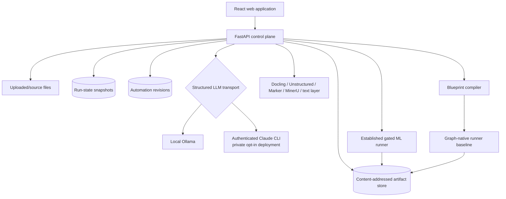

# Agentic DS — Canonical System Architecture Report

**Status:** current implementation architecture

**Last audited:** 2026-08-26

**Canonical scope:** product flow, runtime, data boundaries, major modules, deployment, and known gaps

## 1. Executive summary

Agentic DS is a guided data-understanding and machine-learning system for users who receive
unfamiliar mixed files and do not yet know what the files mean, how they relate, or what ML
problem is justified.

The default product is deliberately opinionated:

```text
Upload
  → Intake and source routing
  → Structured/document understanding
  → Cross-source synthesis
  → Decide what may enter ML
  → Propose and accept/adjust a plan
  → Materialize the established base ML pipeline
  → Execute with visible states and controls
  → Review artifacts and results
```

The free-form graph editor remains available as **Advanced / Experimental**. It is no longer the
primary journey. The default UI uses the same persisted blueprint and run state, but presents them
as a guided continuation so a new user always has an obvious next action.

The system is local-first, but its LLM transport is configurable:

- `OllamaClient` is the default self-hosted runtime.
- `ClaudeCliClient` is an opt-in private-deployment backend that uses an already authenticated
  Claude Code subscription. It strips API/provider environment variables and disables tools,
  MCP, repository settings, and coding-agent permissions. It does not use an Anthropic API key,
  but inference is remote and therefore is not a fully local execution path.
- The current private test deployment uses Claude CLI Haiku at low effort with a 90-second timeout.

The core architecture separates four authorities:

1. Deterministic executors measure, parse, extract, integrate, split, train, and evaluate.
2. Agents interpret bounded evidence and propose reports, problems, configurations, and graph edits.
3. Typed contracts, graph validation, deterministic gates, review boundaries, and sandboxing decide
   what is allowed to execute or proceed.
4. The React UI projects persisted evidence, plans, attempts, and artifacts; browser state is not an
   execution authority.

## 2. Runtime topology



FastAPI serves both the control-plane API and the compiled frontend. The public test deployment
binds Uvicorn to `127.0.0.1:8077`; Cloudflare Tunnel is the only public ingress. A password/session
gate protects the application. The server refuses public startup when credentials are absent.

## 3. Source, evidence, and trust boundaries

### 3.1 Two data planes

The executor plane may load source rows and PDF content. The agent/browser plane receives bounded
projections: schemas, aggregates, measured relationships, extraction excerpts with provenance,
artifact summaries, and approved configuration. Agents do not receive raw tabular rows.

The important contracts are:

- `src/ads/contracts/datacard.py` — row-free table and column profiles.
- `src/ads/contracts/documents.py` — normalized document pages, candidate tables/figures,
  per-file outcomes, review decisions, and extraction summaries.
- `src/ads/contracts/integration.py` — proposed and executor-verified integration plans.
- `src/ads/contracts/dataflow.py` — immutable `TableAsset` and exact `SplitManifest` artifacts.
- `src/ads/contracts/staging.py` — the complete pre-ML workspace, proposal, graph, layout, reports,
  chat history, and component output references.

### 3.2 Evidence classes

The UI and contracts preserve four visibly different states:

| Layer | Producer | Meaning |
|---|---|---|
| measured | host profiler/test | directly observed statistic or relationship |
| executor | registered deterministic capability | parsed, transformed, trained, or evaluated result |
| agent proposal | bounded LLM | interpretation or recommended future action |
| human decision | person | accepted plan, review, override, or candidate promotion |

Agent interpretation never becomes measured evidence merely because it is shown next to it.
Unreviewed PDF tables remain **Candidate — not trusted structured data**.

## 4. Default journey, end to end

### 4.1 Home and data project creation

The Home screen leads with **Understand unfamiliar data** and points to a Data Project. The empty
project explains the five guided steps before asking for files.

Key frontend files:

- `web/src/pages/Catalog.tsx` — Home metrics and the recommended start action.
- `web/src/components/Shell.tsx` — navigation; the primary workspace is **Data projects**.
- `web/src/pages/AutomationWorkspace.tsx` — project/run coordinator and lifecycle owner.
- `web/src/components/automationWorkspaceState.ts` — pure lifecycle selection:
  `empty → source → understanding → proposal → guided_pipeline`; `workflow` is reached only when
  Advanced editing is explicitly requested.

`AutomationWorkspace.tsx` uploads all selected files into one source group, attaches that source to
the reusable automation record, resolves the latest execution, polls active run status, and keeps
the URL bound to the exact automation/run pair.

### 4.2 Upload and source registration

`ControlPlane.upload()` in `src/ads/api/service.py` sanitizes the filename, accepts only registered
extensions, writes bytes under a generated upload group, prevents duplicate names, and returns a
stable `upload:<token>` source id. Files selected together remain one source so cross-table
measurements are possible.

Current upload support:

- CSV, TSV, and TXT through the delimited-text loader;
- XLSX, XLSM, and XLS through the workbook loader;
- Parquet and PQ;
- PDF.

Important limitation: TXT is still routed to the delimited-text loader. The intended product needs
a content-aware TXT router that distinguishes a narrative report from structured/semi-structured
data. Until that classifier exists, a narrative TXT is offered to the CSV reader.

What no longer happens is that this takes the source down with it. A prose file raised out of
`load_directory`, and `source_profile` turned it into a 400, so a folder containing a README was
unprofilable in its entirety with nothing naming the file at fault. Loader failures are now
collected per file and the offending file is reported as `needs_review` carrying the parser's
reason, while the rest of the source loads.

### 4.3 Intake is the first visible execution phase

`ControlPlane.source_profile()` performs deterministic discovery before a run begins:

1. `src/ads/intake/loaders.py` reads structured files. It sniffs CSV encoding/delimiters, handles
   workbook sheets independently, infers suspicious Excel header rows, normalizes duplicate or
   blank columns, and records every repair as a `LoadIssue`.
2. `src/ads/intake/profiler.py` creates DataCards with types, semantic types, sensitivity,
   missingness, uniqueness, target suitability, and aggregate quality information.
3. `src/ads/intake/keys.py` measures candidate primary keys.
4. `src/ads/discovery/measurements.py` measures cross-table key overlap, orphan rate, parent
   coverage, name affinity, and cardinality.
5. `src/ads/documents/pdf.py` reads PDF metadata/text-page availability for the initial safe profile.
6. `service.py` writes an exact `source_files` routing record: structured, documents, or unsupported.

The browser immediately renders:

```text
Uploaded files → Intake
                    ├─ Structured data
                    ├─ Documents
                    └─ Needs review
```

Every file name remains attached to its branch. `web/src/components/stagingRoutingState.ts` derives
truthful branch/substep states from persisted events; it never invents percentages. The running
structured steps are Inspect, Profile, Find relationships, Explain. Document steps are Inspect,
Extract, Verify, Explain.

### 4.4 Staging creates a real resumable run

Clicking **Run Intake** calls `POST /api/runs/staged`, implemented by
`ControlPlane.stage_run()` in `src/ads/api/service.py`. This is not a preview:

- structured sources execute the established workflow through `schema_discovery` and stop;
- document extraction may run alongside structured work;
- PDF-only sources execute document understanding and synthesis without pretending that a tabular
  ML pipeline exists;
- all events, attempts, artifacts, errors, and progress are persisted under the same run id;
- the run later resumes after schema discovery rather than repeating intake.

The optional reuse checkbox controls `_staged_cache`. Reuse is off by default. Cache identity is a
source fingerprint based on relative path, byte size, and nanosecond modification time. This avoids
re-reading large unchanged sources but does not provide the strength of a full content hash; equal
size and equal mtime after a mutation is the documented edge case.

### 4.5 Structured understanding and schema discovery

The intake stage in `src/ads/pipeline/stages.py` materializes DataCards and the blackboard objects
needed by later deterministic executors. Schema discovery is agent-backed but evidence-constrained:

- `src/ads/agents/schema_discovery.py` proposes the join/integration interpretation from DataCards.
- `src/ads/agents/schema_investigator.py` may request bounded follow-up investigation.
- `src/ads/integration/executor.py` executes join trials against host-side frames and measures
  fan-out, row loss, and grain behavior.
- `src/ads/contracts/integration.py` keeps proposed judgment separate from measured trials and the
  accepted `IntegrationPlan`.

The schema visualization no longer renders a dense all-columns ER diagram by default. The staging
canvas shows high-level routing and evidence counts; measured relationships, cardinality, coverage,
and orphan risk open in the inspector. This is implemented by
`web/src/components/UnderstandingWorkspace.tsx`.

### 4.6 Document understanding

`src/ads/documents/extraction.py` is the normalized extractor boundary. All engines return the same
`DocumentExtraction` contract, including engine/version, OCR mode, duration, page-provenanced
markdown, candidate tables, candidate figures, per-file status, warnings, and partial failure.

Supported adapters:

- Docling — main in-process structure/table/OCR path;
- Unstructured — optional in-process alternative;
- Marker — isolated worker environment;
- MinerU — isolated worker environment;
- text layer — built-in fallback based on PDF text.

`scripts/install_document_engines.ps1` installs optional document engines. Marker and MinerU use
separate environments under `.document-envs` to avoid dependency conflicts with the API runtime.

`ControlPlane._execute_document_understanding()` selects the enabled document component settings,
emits document/file start/ready/failure events, persists normalized extraction output, records
duration and warnings, and refreshes the `StagingWorkspace`. A single failed file is retained as a
failed per-file outcome instead of silently disappearing.

Candidate IDs are normalized to the contract-safe pattern in
`src/ads/documents/extraction.py::_candidate_id()`. This prevents spaces and parentheses in source
filenames from causing the previous Pydantic failure.

### 4.7 Review and promotion of PDF tables

Extraction does not authorize training use.

1. `ControlPlane.review_document_tables()` calls
   `src/ads/documents/promotion.py:create_document_table_review()`.
2. The resulting `DocumentTableReview` records exact candidate id, source file, page, columns,
   accepted/rejected decision, reviewer, and timestamp.
3. `ControlPlane.promote_document_tables()` verifies the review belongs to the same run.
4. `promote_reviewed_document_tables()` reloads the exact extraction, rejects changed provenance or
   malformed/ragged tables, and persists accepted candidates as immutable Parquet-backed
   `TableAsset` artifacts.

Current boundary: promoted `TableAsset` artifacts exist and are provenance-safe, but the guided UI
does not yet provide the complete candidate review/promote interaction or automatically rebuild the
selected ML input set after promotion.

### 4.8 Cross-source synthesis and Planner proposal

`ControlPlane._generate_staging_analysis()` assembles bounded context from:

- routed source filenames and formats;
- row-free structured table summaries;
- measured relationships;
- document extraction excerpts limited by a character budget and carrying file/page provenance.

One structured LLM call creates two or three bilingual report artifacts and a runtime
recommendation. The structured response may recommend `create_pipeline`, `defer_pipeline`, or
`no_pipeline`; the prompt is not biased toward creating or denying ML. A PDF-only TOEFL practice
source, for example, may truthfully end with understanding artifacts and no justified ML pipeline.

`ControlPlane._persist_staging_workspace()` is the durable merge boundary. It stores:

- exact intake/schema/document artifact ids;
- measured relationships plus attached interpretation;
- `StagingReportArtifact` ids attached to producer components;
- bilingual English/Turkish report fields;
- Planner chat history;
- the current blueprint/layout;
- component output readiness;
- `RuntimeConfigurationPlan`, rationale, checkpoints, directives, and retry budgets;
- planner model and failure state.

Each update writes a new immutable `StagingWorkspace` artifact. The UI can therefore inspect the
reports and chat that produced an accepted plan after the run finishes.

### 4.9 Deciding what enters ML

The guided proposal is the trust transition between understanding and modeling:

- supported structured source files are shown under **Enters ML**;
- PDFs are **Context only** unless an extracted candidate is reviewed and promoted;
- the base table and grain come from the measured/accepted integration plan;
- target, task, metric, validation, stage directives, checkpoint stages, automatic stages, and
  retry budgets are visible before execution;
- no/deferred recommendations do not expose a primary Run action.

The current role display is derived from deterministic source routing plus document review state.
A first-class durable per-source role contract (`ml_input`, `context_only`, `needs_review`,
`excluded`) is still needed so later Planner revisions and promotions cannot diverge from the UI.

### 4.10 Accepting and materializing the base pipeline

`POST /api/runs/{run_id}/staging/plan/accept` calls `ControlPlane.accept_staging_plan()`.
Acceptance is an explicit human decision: it validates the saved blueprint, marks the exact proposal
accepted, persists a new staging snapshot, compiles an immutable execution plan, and synchronizes
the Automation record.

The default UI then renders `web/src/components/GuidedPipeline.tsx`, not the free-form editor. It
shows:

- Data understood;
- Prepare ML data;
- Define the objective;
- Analyze and validate;
- Build and split;
- Train and evaluate;
- Review results.

These groups are intended to be projections of the actual established workflow nodes and their
statuses. Artifact chips are derived from attempt artifact ids. Clicking a group loads the
stage-detail API; clicking an artifact loads a safe preview.

The group-to-stage map is now held to the workflow specification. The Analyze and validate group
previously named `exploratory_analysis` (an artifact type) and `lineage_audit` (an id nothing
produces) instead of `eda` and `leakage_audit`, so both stages executed but were omitted from that
group's live status, inspection, and artifact count. `tests/test_guided_pipeline_groups.py` parses
the map out of the component and fails if any group names a stage the workflow does not declare, or
if an executed stage is displayed by no group.

### 4.11 Established base ML pipeline

`src/ads/pipeline/workflow.py` defines the production agentic specification. Its stages are:

| Stage | Important implementation |
|---|---|
| intake | `pipeline/stages.py`, `intake/*` |
| schema discovery | `agents/schema_discovery.py`, `pipeline/agent_stages.py` |
| integration | `integration/executor.py`, `pipeline/stages.py` |
| problem discovery | `agents/problem_discovery.py`, `contracts/problem.py` |
| validation strategy | `agents/validation_strategy.py`, `discovery/validation_signals.py` |
| EDA | `eda/profiler.py`, `agents/eda_investigator.py` |
| leakage audit | `discovery/leakage.py`, `agents/leakage_investigator.py` |
| feature pipeline | `pipeline/stages.py`, `agents/feature_investigator.py` |
| splitting | `splitting/executor.py`, `contracts/dataflow.py` |
| training | `training/runner.py`, `training/frame_contracts.py` |
| evaluation | `reporting/evaluation.py` |
| report | `reporting/markdown.py` |

`src/ads/orchestration/runner.py` is an explicit state machine:

```text
stage → persist artifacts → critique → deterministic gate
      → proceed | retry with correction | escalate to human | abort
```

`src/ads/orchestration/state.py` pins exact inputs to each attempt. A retry inherits the rejected
attempt's input bindings so the correction is the only intended change. `src/ads/gates/` applies
hard constraints before risk, measured signals, and autonomy preferences.

`ControlPlane.start_staged_run()` applies the accepted plan, merges graph checkpoint/retry policy,
loads stage directives, and resumes the same run after schema discovery. `fully_auto` removes
routine human checkpoints only after plan acceptance; hard leakage/privacy/safety gates remain.

### 4.12 Execution controls and failure behavior

The guided page supports:

- **Run / Continue** — `POST /runs/{id}/start`, same run id and artifact lineage;
- **Pause after current stage** — `POST /runs/{id}/pause`; a cooperative request lets the current
  stage finish, pauses only after an `auto_proceed` gate boundary, persists artifacts, and resumes
  from the next stage;
- **Retry from Intake** — creates a fresh auditable staging run when the previous execution failed;
- **Inspect** — loads current progress, exact attempts, stage evidence, and artifacts;
- **Review results** — opens execution history and catalogs.

Staging/document/Planner failures are promoted to run-level `failed` state, persisted with their
error, and shown as a visible blocking banner. The pipeline does not silently claim that a proposal
exists when synthesis failed.

Current control gap: there is no immediate hard-cancel of a running Python/LLM call. Cooperative
pause takes effect at the next successful stage boundary. A separate cancellable worker/process
contract is required for safe hard stop.

## 5. Planner, agent, and model architecture

### 5.1 Structured LLM boundary

All runtime model adapters implement `StructuredLLM.generate_structured()`. Pydantic schemas define
the only accepted output shape. Agents cannot add arbitrary fields or executable capabilities.

- `src/ads/llm/client.py` — Ollama structured-output client and model profiles.
- `src/ads/llm/claude_cli.py` — subscription-authenticated CLI adapter. API tokens and alternate
  provider variables are removed from the child environment; tools and setting sources are empty.
- `src/ads/agents/base.py` and `src/ads/agents/runtime.py` — contract validation, repair, audit, and
  bounded tool execution.

### 5.2 Planner authority

The Planner is a control-plane agent, not a fake data dependency. It may explain evidence, generate
reports, recommend configuration, choose registered components/settings, and propose up to three
problem branches. It may not invent component types, ports, contracts, executor ids, or code.

The current automatic synthesis uses a compact contract for latency. Interactive Planner chat in
`ControlPlane.planner_chat()` receives the component catalog and may apply bounded graph operations.

### 5.3 Language behavior

Chat responds naturally in the language of the user/model interaction; it does not run a separate
translation agent. Persisted user-facing artifacts carry canonical English and Turkish companions
from the same model call. Identifiers, code, metrics, columns, and configuration keys are never
translated.

Catalog UI text uses edge-selected translation:

- backend: `src/ads/api/i18n.py`;
- frontend: `web/src/lib/i18n.ts`;
- language parameter: added by `web/src/lib/api.ts` to every request.

Both catalogues are keyed on the English source string, so an untranslated string renders in
English rather than as a missing-key placeholder. That degradation is deliberate, but it is also
silent: 115 frontend keys reached `t()` with no Turkish entry, which left roughly a quarter of the
interface — including Home, Data projects, and the guided pipeline — in English while the selected
language was Turkish. Both catalogues are now complete, and `web/src/lib/i18n.test.ts` holds them
there: it scans every source file for `t("...")` literals, fails on any key with no Turkish entry,
and fails on a duplicate key, which silently overrides an earlier translation.

## 6. Graph architecture: default versus advanced

### 6.1 Default product

The default product is the guided journey described above. It uses a persisted
`PipelineBlueprint`, but hides graph-authoring complexity until requested. Acceptance materializes
the recommended continuation directly after staging.

### 6.2 Advanced / Experimental editor

`web/src/components/PipelineBuilder.tsx` uses React Flow and ELK to show the full typed graph.
Component configuration, ports, review policy, artifact output, Planner, manual layout, branch
collapse, and auto-layout are available. It is explicitly experimental because not every catalog
node has a production executor adapter under the graph-native runner.

Host-owned graph vocabulary:

- `src/ads/automation/catalog.py` — registered component definitions, capabilities, evidence
  layer, resource/latency class, ports, and settings schemas.
- `src/ads/automation/settings.py` — closed Pydantic setting models.
- `src/ads/contracts/registry.py` — versioned edge contracts.
- `src/ads/staging/blueprint.py` — opinionated multimodal default graph.
- `src/ads/contracts/staging.py` — blueprint, connections, controls, layout, and graph patches.

Graph mutations are validated for registered components/contracts, exact ports, type compatibility,
single-input cardinality, required inputs, unique ids, and acyclicity.

### 6.3 Compiler and graph-native runner baseline

`src/ads/automation/compiler.py` freezes a validated blueprint into
`AutomationExecutionPlan`: topological order, exact edge bindings, catalog/executor versions,
settings, gate policy, scope, output contracts, and pause boundary. UI-only layout and display name
are excluded from the execution fingerprint.

`src/ads/automation/runner.py` is a restart-safe sequential DAG runner. It persists `NodeAttempt`
artifacts, resolves exact released outputs, validates executor return contracts, supports
pause/review/failure, and reuses successful attempts by semantic execution key.

Current production truth: the guided **Default ML pipeline** still delegates to the established
gated runner. The graph-native runner is a tested baseline for future component-level execution;
many catalog capabilities still lack registered production executors. The UI must not claim n8n
parity or arbitrary graph execution yet.

## 7. Persistence, caching, and lineage

### 7.1 Artifact store

`src/ads/store/artifacts.py` provides a SQLite-indexed, content-addressed immutable artifact store.
Semantic payload determines artifact id; creation timestamps do not. Large binary payloads such as
Parquet live in per-artifact blob directories.

### 7.2 Run snapshots

`ControlPlane._persist_runtime()` writes atomic JSON snapshots under `data/run-state`. Active
threads also retain runtime state in memory. A snapshot that claims to be active without a matching
in-process worker is reconciled to `interrupted` rather than displayed as running forever.

### 7.3 Automation records

`src/ads/automation/store.py` persists reusable Data Projects/Automations, optimistic revisions,
source binding, semantic blueprint, UI-only layout, latest workspace id, and execution references.
Runs and editor state are separate: viewing an old execution does not rewrite the saved project.

## 8. Frontend module map

| Module | Responsibility |
|---|---|
| `web/src/App.tsx` | routes |
| `web/src/components/Shell.tsx` | navigation, account shell, global language picker |
| `web/src/pages/Catalog.tsx` | guided Home plus datasets/models/reports catalogs |
| `web/src/pages/AutomationWorkspace.tsx` | upload, lifecycle, polling, acceptance, execution controls |
| `web/src/components/UnderstandingWorkspace.tsx` | routed staging canvas, inspectors, reports, relationship evidence, proposal |
| `web/src/components/stagingRoutingState.ts` | event-to-visible-status reducer |
| `web/src/components/GuidedPipeline.tsx` | accepted-plan summary and live base-pipeline continuation |
| `web/src/components/PipelineBuilder.tsx` | Advanced / Experimental graph editor |
| `web/src/components/PlannerPanel.tsx` | interactive Planner conversation |
| `web/src/lib/api.ts` | typed API client and language propagation |
| `web/src/lib/status.ts` | one run/stage status vocabulary |

Both staging and guided canvases implement background drag-to-pan without stealing clicks from
buttons, fields, links, inspectors, or dialogs.

## 9. Deployment and authentication

- `scripts/serve_public.py` loads `.auth.env` and `.runtime.env`, refuses to start without a
  credential, creates the FastAPI application, and binds only to loopback.
- `scripts/start_public.ps1` starts the server hidden, verifies the listener, and writes durable
  logs under `data/logs`.
- `src/ads/api/auth.py` provides password hashing, signed secure sessions, and in-process rate
  limiting.
- `deploy/cloudflared-config.yml` and `deploy/README.md` document the tunnel.
- `scripts/restart_public.ps1` is what `deploy_main.py` invokes. `start_public.ps1` exits early
  when the port is already held -- it is a start, not a restart, and that guard is what stops a
  second server racing the first for the same socket. Continuous deployment needs the opposite,
  so this is a separate script rather than a flag, leaving the guard intact for anyone starting
  by hand. It waits for the socket rather than the process, because a stopped process can hold
  the port in TIME_WAIT long enough for the next bind to fail and look like a broken deploy.
- `scripts/deploy_main.py` closes the loop between CI and the serving host. GitHub Actions runs
  the tests; nothing was moving the result onto the machine behind the tunnel, so the deployment
  worktree sat wherever it was last left -- it reached three commits behind `main` while looking
  perfectly healthy, which is the failure mode of manual deployment: not an error, silence.
  It works by pull rather than push, because the serving host has no inbound path of its own and
  there is nothing for CI to deploy *to*. It fast-forwards only (a diverged deployment branch means
  somebody committed on the serving host, and discarding that silently is worse than stopping),
  never restarts on an unchanged commit (restarting drops in-flight runs), and after restarting
  checks that `/api/runs` still answers 401 -- a server answering 200 there is one with
  authentication off, and `--rollback-on-failure` returns it to the previous commit.

Authentication protects the private test deployment, not multi-tenant production. There is no
durable login audit and no independent Cloudflare Access policy.

Accounts are generated by `scripts/set_users.py`, which writes scrypt hashes to `.auth.env` and
prints each password once. The auth middleware records the signed-in name on the request, so a
route can answer *who* is asking rather than only *whether* someone is.

Uploaded sources carry an owner and a visibility, and `src/ads/api/teams.py` decides who sees what:

- `ADS_TEAMS=core:ishak-ads,gonenc-ads;ml:emre-ads,berkin-ads` — semicolons separate teams, a
  colon separates a name from its members, commas separate members. A person may be in several.
- The owner always sees their own data. A source you cannot see is a source you cannot delete.
- Everything else is visible to people sharing a team, unless its owner marked it `private`
  through `POST /api/data-sources/{id}/visibility`.
- **Unset means one implicit team containing everyone**, which is the behaviour that existed before
  the module, so an unconfigured deployment is unchanged.
- A source with no recorded owner — anything uploaded before this existed, or whose record was lost
  — stays visible. Retroactively hiding data is the worse mistake.

This is a workspace boundary, not a permissions system: no roles, no grants, no per-file rules.
It is not a security control against a hostile signed-in user, and the ownership registry is a
plain JSON file beside the uploads.

## 10. Current gaps and next engineering priorities

1. Add content-aware routing for TXT and other ambiguous semi-structured sources. A prose
   file no longer fails the whole source, but it is still offered to the CSV reader first.
2. Add first-class durable source-use decisions and make Planner revisions/promotion update them.
3. Complete the guided PDF candidate review/promote UI and reconnect accepted TableAssets into the
   ML input proposal.
4. Add chart-data extraction as a separate reviewed capability; a figure candidate is not a table.
5. Move all catalog components behind registered graph-native executors before enabling broad
   customization or claiming n8n-level execution.
6. Fork multi-problem branches from the exact shared integrated `TableAsset`, not repeated intake.
7. Add a cancellable process/worker protocol for immediate hard stop of long model/extractor work.
8. Invalidate descendant node attempts after an accepted semantic graph edit.
9. Lazy-load React Flow/ELK to reduce the initial JavaScript bundle.
10. Replace single-account tunnel authentication before real multi-user deployment.

## 11. Verification baseline

At the 2026-08-26 audit:

- the full Python suite passed: 884 passed, 6 skipped;
- Ruff passed for `src` and `tests`;
- all 28 frontend tests passed;
- TypeScript compilation and the Vite production build passed, and the committed bundle under
  `src/ads/api/static` matches the sources;
- both translation catalogues are complete: every `t()` key on either side has a Turkish entry;
- `benchmarks/understanding_v0`, measured against the live deployment on real data (MovieLens
  `ml-latest-small` plus the arXiv paper analysing it): relationship recall 3/3, precision 1.0,
  cardinality 1.0 including the `links`-to-`movies` 1:1, and all three overlap rates within
  tolerance. That benchmark found two defects on its first run -- camelCase integer keys were not
  recognised as keys at all, so relationship detection returned nothing for the whole corpus, and
  one unreadable file failed the entire source.

Not repeated in this pass, and last verified at the preceding audit: the deployed loopback health
endpoint returning 200, and an unauthenticated API request returning 401. The preceding audit ran
against commit `8862fa5` on `codex/graph-automation` in `agentic-ds-dev`.

## 12. Non-negotiable invariants

1. Do not send raw structured rows to agents.
2. Keep measured/extracted evidence visually and contractually distinct from interpretation.
3. Do not let unreviewed PDF tables or figures become training data.
4. Do not execute browser graph state; persist, validate, and compile it first.
5. Do not let Planner/human convenience weaken a deterministic hard gate.
6. Preserve immutable artifacts, exact producer lineage, and retry input binding.
7. Surface partial failures and unsupported files; never let a source silently disappear.
8. Keep Advanced customization honest about executor coverage.
9. Generate bilingual artifact companions in one model response; do not add a translation agent.
10. State clearly whether a deployment uses local Ollama or remote Claude CLI inference.
