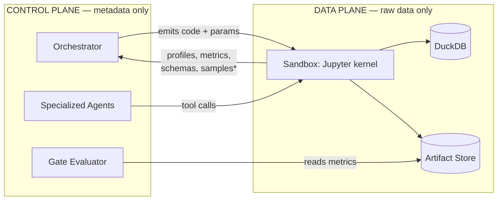
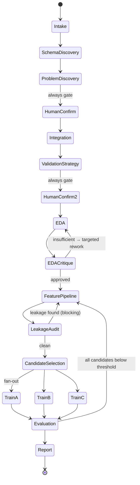

# Agentic Data Science / ML Pipeline — System Architecture & Technology Evaluation

**Status:** Architecture decision report (pre-implementation)
**Scope:** Fully local / on-premise, air-gappable. No cloud LLM APIs, no cloud services.
**Date of technology verification:** 2026-08-11 (licenses and activity verified against GitHub API and upstream LICENSE files; see §14–§15)
**Out of scope by instruction:** RLHF, DPO, SFT, knowledge distillation, and any LLM training/learning strategy. This report treats all LLMs as fixed, locally-served inference endpoints.

---

## 1. Executive Summary

### 1.1 The recommendation in one paragraph

Build **our own agentic orchestration layer**, but do **not** write the graph execution kernel from scratch. Use **LangGraph (MIT)** strictly as a *replaceable execution kernel* — it supplies the three genuinely expensive primitives (durable checkpointing, `interrupt()`/resume, dynamic parallel fan-out) — and put **our own declarative `WorkflowSpec`** in front of it as the system's real source of truth. Use **PydanticAI (MIT)** for every LLM interaction, because the single highest-leverage decision in this system is that *agents return validated typed objects, not prose*. Do **not** build the product on top of n8n, Windmill, Node-RED, Kestra, Activepieces, Langflow, or Flowise: each is either license-hostile to a commercial product, architecturally mismatched to a shared typed data-science state, or both. Build the visual editor later as a view over our `WorkflowSpec`, not as an adopted third-party canvas.

### 1.2 The five decisions that matter

| # | Decision | Choice | Why it is the pivot |
|---|---|---|---|
| 1 | Workflow foundation | Custom `WorkflowSpec` compiled onto LangGraph | Preserves branching/loop/checkpoint future without inheriting a foreign product's data model or license |
| 2 | Human-in-the-loop trigger | **Deterministic Gate Evaluator**, not a system prompt | An LLM asked "should I ask the human?" is unreliable and unauditable; a decision table is both |
| 3 | LLM/tool boundary | LLM sees **metadata and profiles**, never raw rows; deterministic Python touches data | Solves accuracy, token cost, PII, and reproducibility simultaneously |
| 4 | Agent output | Pydantic-validated structured contracts + constrained decoding | Converts "agent quality" from a prompt problem into a testable software problem |
| 5 | ML execution | Deterministic in-house `ds-toolkit` + AutoGluon; MLflow for tracking only | Stops the LLM from re-deriving `sklearn` badly on every run |

### 1.3 What the MVP is

A user drops messy multi-table CSV/Excel/DB data into the system and gets back a reproducible baseline ML project — trained model, evaluation, feature pipeline, a runnable standalone script, and a report — with an Orchestrator that critiques each stage's output and escalates to the human according to a configurable autonomy profile. The MVP workflow is **fixed in shape but not linear in execution**: it has retry loops, a deterministic gate after every stage, and one genuine parallel fan-out (model candidates).

### 1.4 Two findings that change the build-vs-buy answer

- **n8n is not open source.** It ships under the Sustainable Use License, which restricts use to "your own internal business purposes" and forbids distributing it commercially. Building a product on it is off the table, and this invalidates the naive "just fork n8n" instinct.
- **PyCaret is no longer MIT.** It is now **FSL-1.1-MIT** (Functional Source License), which prohibits competing commercial use for two years post-release. It is disqualified as a core dependency of a commercial platform.

Both are documented with sources in §14–§15.

---

## 2. Problem Definition

### 2.1 What the user actually needs

The system takes a user from **T0 (raw, messy, uploaded enterprise data)** to a **completed baseline ML project** with minimal but *controllable* human involvement. "Messy enterprise data" here has specific, load-bearing properties:

- **Multiple tables** with implicit, undocumented relationships (physician records ↔ accounting entries ↔ transaction history)
- **Inconsistent schemas** across files that logically represent the same entity
- **Mixed formats** — CSV, Excel (multi-sheet, merged headers, footnotes), Parquet, live SQL
- **No stated ML target.** The problem itself must be discovered and proposed
- **Domain-loaded semantics** — an "amount" column means something different in a ledger than in a transaction log
- **Sensitivity.** Physician and banking data cannot be shipped to an LLM context wholesale, even a local one, without a deliberate decision

### 2.2 Why this is hard beyond "call an LLM in a loop"

Naive agentic data science fails in five reproducible ways. The architecture must be judged on whether it structurally prevents each:

| Failure mode | Naive symptom | Architectural counter |
|---|---|---|
| **Silent target leakage** | 0.99 AUC, worthless model | Deterministic leakage audit as a blocking gate (§10.5) |
| **Wrong validation strategy** | Random split on temporal/grouped data | Explicit Validation Strategy stage before any modeling (§6) |
| **Context rot** | Agent 8 reasons over agent 1's stale assumptions | Contract-passing + artifact store, not a shared chat log (§9) |
| **Unbounded code flailing** | Agent rewrites `train_test_split` badly, 40 times | Deterministic tool library; LLM composes, doesn't implement (§13) |
| **Unfalsifiable "done"** | Agent declares success; nobody can tell | Structured validation + deterministic acceptance criteria per stage (§8.6) |

### 2.3 Long-term product shape

The end state resembles an n8n-style interactive builder specialized for agentic data science: placeable reusable components, branching, loops, retries, checkpoints, parallel branches, human intervention anywhere, dynamic routing on intermediate results, and per-agent tool/context boundaries. **The MVP must not foreclose this**, which is the single strongest constraint on the architecture — it is why a hardcoded Python script, however fast to write, is rejected in §18.

---

## 3. Design Goals and Constraints

### 3.1 Hard constraints

| ID | Constraint | Consequence |
|---|---|---|
| C1 | Fully local / on-premise; air-gappable | No cloud LLM APIs, no hosted sandboxes (E2B cloud, LangSmith), no telemetry-by-default. Every dependency must install from a local mirror |
| C2 | Enterprise-sensitive data | Raw rows must not leave the execution boundary or enter LLM context by default |
| C3 | Commercial product intent | Copyleft (AGPL) and source-available (SUL, FSL, BSL) licenses in the *core* are disqualifying |
| C4 | Local LLMs only | Weaker instruction-following than frontier models ⇒ constrained decoding and typed validation are mandatory, not optional |
| C5 | Reproducibility | Every result must be re-derivable from stored artifacts + code, without an LLM in the loop |

### 3.2 Design goals, ranked

1. **Auditability over autonomy.** Every automated decision must be explainable by pointing at a rule or a metric, not at a prompt.
2. **Determinism where possible, LLM where necessary.** The LLM's job is *judgment and composition*; Python's job is *computation*.
3. **Replaceable kernel.** No third-party framework may become load-bearing for the domain model.
4. **Simplest thing that preserves the future.** Reject complexity that only pays off in a hypothetical v3 (this is why Temporal, OPA, and a visual editor are all deferred).
5. **Resumability as a first-class feature.** A 4-hour run that fails at stage 9 must resume at stage 9, and must be forkable at stage 6.

### 3.3 Explicit non-goals for the MVP

- Multi-tenancy, RBAC, SSO
- Distributed/multi-node execution
- Deep learning, NLP, computer vision, time-series forecasting (tabular supervised learning only)
- The visual editor itself (only its *data model* is in MVP scope)
- Model deployment/serving

### 3.4 The local LLM reality check

This constraint is under-appreciated and shapes §8 heavily. A locally-served 30B-class model will not reliably follow a 2,000-token system prompt describing a 12-field JSON output. Therefore:

- **Constrained decoding is mandatory** (vLLM + XGrammar backend), not a nice-to-have
- **Contracts must be small.** Prefer five 4-field outputs over one 20-field output
- **Model routing is required.** A large model for orchestration/code generation; a small fast model for classification, extraction, and routing decisions
- **Self-reported confidence is worthless** and must never gate anything (§10.3)

---

## 4. Proposed System Architecture

### 4.1 Layered view

The system is seven layers. The critical property is that **each layer depends only downward**, and the domain layers (3–5) have no compile-time dependency on the orchestration kernel's API.

```
┌──────────────────────────────────────────────────────────────────────┐
│ L7  PRESENTATION      Web UI · run timeline · artifact viewer ·      │
│                       approval inbox · (future) visual graph editor  │
├──────────────────────────────────────────────────────────────────────┤
│ L6  CONTROL PLANE     FastAPI · run lifecycle · SSE event stream ·   │
│                       approval API · autonomy profile management     │
├──────────────────────────────────────────────────────────────────────┤
│ L5  GOVERNANCE        Gate Evaluator (deterministic) · risk classes ·│
│     ★ our core        autonomy profiles · tool permission broker ·   │
│                       validation registry · audit log               │
├──────────────────────────────────────────────────────────────────────┤
│ L4  ORCHESTRATION     WorkflowSpec (declarative, ours)               │
│                       ── compiles to ──▶ LangGraph kernel           │
│                       checkpointer · interrupt/resume · fan-out      │
├──────────────────────────────────────────────────────────────────────┤
│ L3  AGENT LAYER       Orchestrator + specialized agents              │
│     ★ our core        PydanticAI · typed contracts · per-agent       │
│                       toolsets · per-agent context assembly          │
├──────────────────────────────────────────────────────────────────────┤
│ L2  TOOL LAYER        ds-toolkit (deterministic Python) ·            │
│                       MCP servers (external//pluggable surface) ·    │
│                       sandboxed code execution                       │
├──────────────────────────────────────────────────────────────────────┤
│ L1  EXECUTION &       Docker sandbox + Jupyter kernel · DuckDB ·     │
│     PERSISTENCE       Postgres (state) · filesystem/MinIO (artifacts)│
│                       MLflow (experiments) · vLLM (LLM serving)      │
└──────────────────────────────────────────────────────────────────────┘
```

★ marks the layers that constitute our actual product and where engineering effort should concentrate. Everything else is assembled from verified open-source components.

### 4.2 The central architectural idea: two-plane separation



*\*Samples are redaction-policy-controlled and off by default for flagged columns.*

**The LLM never sees a full dataset.** It sees a `DataCard` — a compact, deterministic summary (schema, dtypes, cardinality, null rates, distributions, candidate keys, sample values subject to redaction policy). All actual computation happens in the data plane via generated-then-sandboxed code or, preferably, via parameterized deterministic tools.

This single decision resolves four problems at once: token economics (a 4M-row table becomes ~2KB), accuracy (LLMs are bad at arithmetic over raw rows, good at reasoning over statistics), privacy/C2 (PII never enters context), and reproducibility (the artifact, not the conversation, is the record).

### 4.3 Component inventory

| Component | Responsibility | Build or reuse |
|---|---|---|
| **WorkflowSpec** | Declarative graph: stages, edges, conditions, gates, retry policy | **Build** (small, ~600 LOC) |
| **Graph kernel** | Traverse, checkpoint, interrupt, resume, fork, fan-out | **Reuse** — LangGraph |
| **Orchestrator Agent** | Intent capture, stage sequencing decisions, artifact critique | **Build** |
| **Specialized agents** | Narrow-scope typed transformations | **Build** on PydanticAI |
| **Gate Evaluator** | Deterministic proceed/retry/escalate/abort decision | **Build** (the product's differentiator) |
| **ds-toolkit** | Deterministic profiling/cleaning/FE/training/eval functions | **Build** (wrapping sklearn/LightGBM/etc.) |
| **Sandbox** | Isolated stateful Python execution | **Reuse + thin wrapper** — Docker + Jupyter kernel |
| **Artifact store** | Content-addressed, immutable, versioned artifacts | **Build thin** over filesystem/MinIO |
| **State store** | Runs, stages, attempts, gates, approvals | **Reuse** — Postgres + LangGraph checkpointer |
| **Experiment tracking** | Model runs, params, metrics, model registry | **Reuse** — MLflow |
| **LLM serving** | Local inference + constrained decoding | **Reuse** — vLLM |

---

## 5. MVP Architecture

### 5.1 Deliberate simplifications

The MVP keeps the *shape* fixed and the *machinery* general. Concretely:

| Aspect | MVP | Future |
|---|---|---|
| Workflow topology | One built-in `WorkflowSpec`, authored by us in YAML | User-composed graphs via visual editor |
| Parallelism | One fan-out point (model candidates) | Arbitrary parallel branches with specialized agents per branch |
| Agents | 7 specialized + 1 Orchestrator | Pluggable agent registry |
| Tools | In-process Python; **one** MCP server (filesystem/DB connectors) | Full MCP tool marketplace |
| Policy | YAML decision table | Optional Cedar for tool authorization |
| Sandbox | Docker + Jupyter kernel, no network | gVisor/microVM runtime |
| UI | Run timeline + approval inbox + artifact viewer | Full graph canvas editor |
| Deployment | `docker compose` on one machine | K8s, worker pools |

### 5.2 MVP process topology

```
docker compose:
  api          FastAPI control plane + LangGraph runtime      (host net: no)
  worker       Stage executor (same image, different entry)
  sandbox-pool Docker-in-Docker or host socket → per-run containers
  postgres     Runs, stages, attempts, checkpoints, approvals
  minio        Artifact store (S3 API, local)          [optional: plain FS]
  mlflow       Tracking server + model registry (backend: postgres)
  vllm         Local LLM serving, OpenAI-compatible endpoint
  ui           React/Next SPA
```

Every service is local. No egress required after image build. On Windows this runs under Docker Desktop/WSL2; the sandbox design (§12) accounts for that.

### 5.3 What "done" means for the MVP

A run is complete when the artifact store contains: a `DataCard` per input table, a documented join/integration plan, an approved `ProblemDefinition`, an EDA report, a fitted **serialized sklearn `Pipeline`** (preprocessing + features + model as one object), a validation report with the chosen split strategy justified, a leakage audit, a model comparison table, an evaluation report on a held-out set, an MLflow run per candidate model, **a standalone reproducible `train.py`** that regenerates the model without any LLM, and a markdown/HTML final report.

That standalone script is the acceptance test for the whole architecture: if it cannot be produced, the system is a demo, not a product.

---

## 6. End-to-End MVP Flow: T0 → Final ML Project

### 6.1 Critique of the proposed pipeline

The proposed 10-step pipeline is a reasonable first draft but has three structural problems:

1. **Problem Discovery is placed before Data Integration.** You cannot responsibly propose "fraud detection" before knowing that the transactions table joins to the physician table on a resolvable key. Target discovery *depends on* the join graph. → **Reorder.**
2. **No validation-strategy stage.** This is the most common cause of worthless enterprise ML models. Transaction data is temporal; physician data is grouped. A random `train_test_split` silently invalidates every downstream number. Deciding the split strategy is a *distinct, early, high-risk decision* that must precede cleaning — because cleaning statistics must be fit on the training fold only. → **Add as a first-class stage.**
3. **Cleaning and Feature Engineering as separate stages that mutate a DataFrame** is the standard route to leakage. They should jointly produce a single **fitted-on-train-only sklearn `Pipeline`**. → **Merge into one stage with a pipeline-object output contract.**

Additionally: intake should be **deterministic and LLM-free** (parsing Excel is a parser problem, not a reasoning problem), and a **leakage audit** deserves to be an explicit blocking gate rather than a hoped-for property.

### 6.2 Revised MVP pipeline

| # | Stage | Primary actor | Output contract | Risk | Default gate |
|---|---|---|---|---|---|
| 0 | **Intake & Profiling** | Deterministic | `DataCard[]` | Low | auto |
| 1 | **Schema & Relationship Discovery** | Agent + deterministic key-detection | `IntegrationPlan` | Med | checkpoint |
| 2 | **Problem Discovery** | Agent + Orchestrator | `ProblemCandidate[]` | **High** | **always ask** |
| 3 | **Data Integration** | Deterministic (executes plan) | `AnalyticalBaseTable` | Med | auto (+validate) |
| 4 | **Validation Strategy Design** | Agent, deterministic checks | `ValidationStrategy` | **High** | **always ask** |
| 5 | **EDA** | Agent + ydata-profiling | `EDAReport` | Low | auto (critique loop) |
| 6 | **Feature Pipeline Construction** | Agent composes, tools execute | fitted `Pipeline` + `FeatureSpec` | Med | checkpoint |
| 7 | **Leakage & Sanity Audit** | **Deterministic only** | `LeakageReport` | **High** | **blocking** |
| 8 | **Model Candidate Selection** | Agent (constrained choice) | `CandidateSet` | Low | auto |
| 9 | **Training** ∥ (fan-out) | Deterministic + AutoGluon/LightGBM | `TrainedModel[]` + MLflow runs | Low | auto |
| 10 | **Evaluation & Comparison** | Deterministic + agent narration | `EvaluationReport` | Med | checkpoint |
| 11 | **Report & Handover** | Agent narrates, tools export | `FinalReport` + `train.py` | Low | auto |

Stages 0, 3, 7, and the compute half of 9–10 contain **no LLM decision authority**. That is roughly 40% of the pipeline made fully deterministic — a deliberate design target.

### 6.3 Flow with control edges



Note the three feedback edges (EDA rework, leakage rework, and the below-threshold retreat from Evaluation back to feature engineering). These are what make this a graph rather than a script, and they are why the kernel must support cycles with checkpointing.

### 6.4 Worked example — the physician/accounting/transactions case

**T0.** User uploads `physicians.xlsx` (3 sheets), `ledger_2019_2024.csv` (4.2M rows), `transactions.parquet`, and provides a DB connection string.

**Stage 0** — deterministic. Excel sheets parsed with header inference; each becomes a `DataCard`: 41 columns, dtypes, null rates, cardinality, candidate PK `physician_id` (unique, non-null), detected date columns, detected currency columns. Zero LLM calls. ~8 seconds.

**Stage 1** — the agent receives only the `DataCard`s (~6KB total, not 4.2M rows). Deterministic key-overlap analysis pre-computes candidate joins (`ledger.provider_ref` ↔ `physicians.physician_id`: 94.2% overlap). The agent's job is *semantic interpretation*: it labels the 94.2% overlap as a probable FK with a 5.8% orphan rate worth flagging, and names the grain of each table. Output: `IntegrationPlan` with typed join specs.

**Stage 2** — the agent proposes ranked `ProblemCandidate`s, each with a *proposed target column, task type, minimum viable row count, and an evidence field naming the columns that justify it*: (a) fraud detection on `ledger.flagged` — but the deterministic check reports 0.3% positive rate and only 1,240 positives, flagged as low-support; (b) income prediction on `physicians.annual_comp` — 89% populated, regression, well-supported; (c) unsupervised anomaly detection — no label needed. **Gate: always ask.** The user picks (b), or overrides entirely with their own prompt.

**Stage 4** — the deterministic checker notices `transactions.txn_date` spans 2019–2024 and that the entity `physician_id` repeats across rows. It surfaces both facts. The agent proposes `GroupKFold` on `physician_id` with a temporal holdout after 2023-06. **Gate: always ask** — this decision determines whether every subsequent number is real.

**Stage 7** — deterministic. Computes per-feature mutual information against the target and flags `total_comp_ytd` at 0.98 correlation with `annual_comp`. **Blocking gate.** Returns to stage 6 with a machine-generated, targeted instruction: `drop_features: [total_comp_ytd]; reason: target_leakage`. No LLM judgment involved in catching it.

**Stage 9** — fan-out: LightGBM, CatBoost, and an AutoGluon medium-quality preset train in parallel, each logging to MLflow.

**Stage 11** — the user receives a model, a report, and `train.py`.

---

## 7. Orchestrator Agent Design

### 7.1 What the Orchestrator is (and is not)

The Orchestrator is **not** a single LLM in a `while` loop with a big system prompt. It is a **composite**: a deterministic state machine that *invokes* LLM reasoning at defined decision points, with all of its authority mediated by the Gate Evaluator.

```
Orchestrator = StateMachine(deterministic)
             + Critic(LLM, typed output, per-stage rubric)
             + GateEvaluator(deterministic, policy-driven)
             + ContextAssembler(deterministic)
```

Splitting it this way means "the Orchestrator made a bad call" is always attributable to one of: a rubric, a rule, or a model — each independently testable.

### 7.2 Responsibilities

| Responsibility | Implementation | LLM involved? |
|---|---|---|
| Capture and formalize user intent | `ProblemDefinition` contract | Yes (typed) |
| Maintain global workflow state | Postgres + checkpointer | No |
| Select next stage | `WorkflowSpec` edges + gate verdict | No |
| **Critique a completed stage artifact** | Per-stage rubric → `CritiqueResult` | **Yes** |
| Decide proceed/retry/escalate/abort | **Gate Evaluator** | **No** |
| Compose targeted correction instructions | `CorrectionRequest` contract | Yes (typed) |
| Assemble each agent's context | Deterministic projection of state | No |
| Enforce tool permissions | Permission broker | No |
| Emit audit events | Event log | No |

The load-bearing separation is between **critique** (LLM, produces evidence and findings) and **decision** (deterministic, consumes evidence and produces a verdict). The LLM is a sensor; the policy is the actuator.

### 7.3 The critique loop

After every stage, the Orchestrator runs a per-stage critique against a **stage-specific rubric** — a checklist authored by us, not invented per-run by the model.

```python
class Finding(BaseModel):
    check_id: str                    # from the stage rubric — closed vocabulary
    severity: Literal["info", "warn", "error"]
    evidence: str = Field(max_length=500)   # must cite the artifact
    suggested_fix: str | None

class CritiqueResult(BaseModel):
    stage_id: str
    rubric_version: str
    findings: list[Finding]
    unmet_criteria: list[str]        # subset of rubric criteria ids
    # NOTE: deliberately no `confidence` field — see §10.3
```

Example rubric for the EDA stage (`eda.v1`), each item independently checkable:

| check_id | Checkable deterministically? | Description |
|---|---|---|
| `eda.target_distribution_reported` | **Yes** | Target distribution present in artifact |
| `eda.all_features_covered` | **Yes** | Every ABT column appears in the report |
| `eda.missingness_quantified` | **Yes** | Null rates per column present |
| `eda.correlation_analysis_present` | **Yes** | Correlation matrix artifact exists |
| `eda.outlier_treatment_discussed` | No | Requires judgment |
| `eda.class_imbalance_addressed` | Partly | Deterministic detection; LLM assesses adequacy |
| `eda.domain_hypotheses_stated` | No | Requires judgment |

**Whatever can be checked deterministically, is** — before the LLM is called. The LLM critic only evaluates the residual judgment items, and it receives the deterministic results as input. This makes the critique cheap, mostly reliable, and hard to hallucinate past. The example the user gave — "EDA finishes → Orchestrator detects insufficient analysis → targeted correction → re-run → approve" — is exactly this loop, with `unmet_criteria` becoming the correction request's payload.

### 7.4 Correction requests are targeted, not "try again"

```python
class CorrectionRequest(BaseModel):
    target_stage: str
    attempt_number: int
    unmet_criteria: list[str]           # what specifically failed
    prior_attempt_summary: str          # what was done, so it isn't repeated
    explicit_instructions: list[str]    # imperative, e.g. "drop total_comp_ytd"
    forbidden_actions: list[str] = []   # e.g. "do not re-run full profiling"
```

The re-invoked agent receives its original contract input **plus** this correction — and critically, *not* the full transcript of its failed attempt. This prevents the failure mode where an agent, shown its own bad reasoning, elaborates on it.

### 7.5 Retry budget and escalation ladder

Deterministic, per stage:

```yaml
retry_policy:
  max_attempts: 3
  on_exhaustion: escalate_to_human      # never silently continue
  escalation_ladder:
    attempt_1: retry_same_agent
    attempt_2: retry_with_larger_model   # model routing escalation
    attempt_3: escalate_to_human
  distinct_failure_required: true        # identical failure twice → escalate early
```

`distinct_failure_required` is a small but valuable rule: if attempt 2 fails the *same* criteria as attempt 1, more attempts are unlikely to help — escalate immediately rather than burning the budget.

---

## 8. Specialized Agent Design

### 8.1 An agent is five things, not one prompt

The instruction not to assume "one system prompt per agent" is correct. In this architecture a specialized agent is a **bundle**:

```python
@dataclass(frozen=True)
class AgentSpec:
    id: str
    input_contract:  type[BaseModel]   # exactly what it receives
    output_contract: type[BaseModel]   # exactly what it must produce
    toolset: list[ToolRef]             # closed set — cannot call anything else
    permission_tier: PermissionTier    # READ_META | READ_DATA | EXECUTE | WRITE_ARTIFACT
    context_policy: ContextPolicy      # which state slices are projected in
    skills: list[SkillRef]             # retrievable procedural knowledge
    validators: list[Validator]        # post-hoc output checks
    model_profile: ModelProfile        # which local model + decoding params
    rubric: RubricRef                  # how the Orchestrator will judge it
    max_attempts: int
```

The system prompt is a *rendering* of this spec, not the spec itself. This is what makes agents testable: an agent is a typed function `input_contract -> output_contract` with declared side-effect permissions, and can be unit-tested with fixture inputs and golden outputs.

### 8.2 Context boundaries — the projection rule

Each agent's context is **deterministically assembled** by projecting the global state, never by handing over the accumulated history.

```python
class ContextPolicy(BaseModel):
    include_artifacts: list[ArtifactType]      # e.g. [DATA_CARD, PROBLEM_DEF]
    include_stage_outputs: list[str]           # explicit stage ids only
    include_raw_samples: bool = False          # default OFF (constraint C2)
    max_sample_rows: int = 0
    redaction_profile: str = "strict"
    max_context_tokens: int = 16000
    on_overflow: Literal["summarize", "truncate_oldest", "fail"] = "summarize"
```

Concrete boundaries for the MVP:

| Agent | Sees | Never sees |
|---|---|---|
| Schema Discovery | All `DataCard`s, key-overlap stats | Raw rows, user's business goal |
| Problem Discovery | `DataCard`s, `IntegrationPlan`, user intent | Raw rows, EDA results |
| EDA | ABT `DataCard`, `ProblemDefinition`, profiling output | Raw rows, model results |
| Feature Pipeline | `EDAReport`, `ValidationStrategy`, feature catalog | Test-fold statistics (**hard boundary**) |
| Model Selection | `ProblemDefinition`, `FeatureSpec`, dataset shape | Raw rows, test-set metrics |
| Evaluation Narrator | Metrics, plots, model metadata | Raw rows, ability to change anything |

"Feature Pipeline never sees test-fold statistics" is not a token-budget decision — it is a *correctness* boundary enforced by the context assembler. The `EvaluationNarrator` having no write permissions is likewise deliberate: it cannot rescue a bad result by changing something.

### 8.3 Shared vs isolated memory

| Memory type | Scope | Contents | Rationale |
|---|---|---|---|
| **Artifact store** | Shared, append-only, immutable | All stage outputs | The single source of truth |
| **Run blackboard** | Shared, small, typed | Decisions, constraints, open questions | Cross-stage facts that aren't artifacts |
| **Agent scratch** | Isolated, discarded after stage | Reasoning traces, failed attempts | Prevents context pollution |
| **Skill library** | Shared, read-only | Procedural know-how (§8.4) | Reusable expertise |
| **Episodic memory** | *Future, optional* | Lessons across runs | Deferred — unproven value, real staleness risk |

**No shared conversation history.** Agents communicate exclusively through typed artifacts and the blackboard. This is the difference between an architecture that degrades at stage 8 and one that does not.

### 8.4 Agent-specific skills

A **skill** is retrievable procedural knowledge, versioned in the repository as markdown + code snippets, injected only when relevant (selected deterministically by stage + data characteristics, not by the LLM).

```
skills/
  feature_engineering/
    high_cardinality_categoricals.md     # trigger: cardinality > 50
    temporal_features_from_dates.md      # trigger: datetime cols present
    aggregations_over_transactions.md    # trigger: one-to-many join present
  validation/
    temporal_split_when_dates_present.md
    grouped_split_when_entity_repeats.md
  imbalance/
    rare_positive_class_strategies.md    # trigger: pos_rate < 0.05
```

This is materially better than one giant system prompt: skills are versioned, individually testable, injected conditionally (keeping context small — critical under C4), and editable by a data scientist without touching agent code.

### 8.5 The LLM vs deterministic split

This table is the operational core of §13 and should be read as a policy, not a suggestion.

| Task | LLM | Deterministic | Rationale |
|---|---|---|---|
| Parse Excel/CSV, infer dtypes | ✗ | ✓ | Solved by pandas/polars; LLM adds errors |
| Compute profile statistics | ✗ | ✓ | Arithmetic |
| Detect candidate keys / FK overlap | ✗ | ✓ | Set operations |
| **Interpret what a table means** | ✓ | ✗ | Semantics, requires world knowledge |
| **Propose ML problems from schema** | ✓ | ✗ | Judgment |
| Validate proposal feasibility (row counts, positive rates) | ✗ | ✓ | Checkable |
| **Choose split strategy** | ✓ | ✗ (but constrained to a closed set) | Judgment over detected signals |
| Detect temporal/grouped structure | ✗ | ✓ | Checkable |
| Execute joins | ✗ | ✓ | SQL |
| **Decide which features to engineer** | ✓ | ✗ | Judgment |
| Implement standard transformers | ✗ | ✓ | `sklearn` already has them |
| Write bespoke domain feature code | ✓ | ✗ | Genuinely novel code |
| Leakage detection | ✗ | ✓ | Statistical test |
| **Select model families** | ✓ (constrained choice) | ✗ | Judgment; but choose from a fixed menu |
| Hyperparameter search | ✗ | ✓ | Optuna/FLAML/AutoGluon do it better |
| Compute metrics | ✗ | ✓ | Arithmetic |
| **Explain results in business terms** | ✓ | ✗ | Language |
| **Decide to ask the human** | ✗ | ✓ | §10 — must be auditable |

A useful heuristic: **if a competent data scientist would reach for a library rather than think, it must be deterministic.**

### 8.6 Output validation — four layers

Every agent output passes through all four before it is accepted:

1. **Schema validation** — Pydantic. Malformed → immediate structured retry with the validation error. Constrained decoding (§16) makes this rare.
2. **Semantic validation** — hand-written, per contract. Does the named target column exist in the ABT? Is the task type consistent with the target's dtype? Do the referenced feature names exist? These catch the majority of real LLM failures.
3. **Executable validation** — for anything producing code or a pipeline: does it run on a 1,000-row sample without error and produce the declared output shape? A smoke test before committing to a full run.
4. **Consistency validation** — cross-artifact. Does the `FeatureSpec` reference only columns in the ABT? Does the `ValidationStrategy` reference a date column that exists?

```python
class ValidationOutcome(BaseModel):
    passed: bool
    layer: Literal["schema", "semantic", "executable", "consistency"]
    failures: list[ValidationFailure]
    repairable: bool                # can we auto-fix without another LLM call?
```

Layer-2 and layer-4 failures are frequently **auto-repairable** (a hallucinated column name that fuzzy-matches an existing one at >0.9 similarity can be corrected deterministically with an audit entry). Auto-repair before retry saves a large fraction of LLM calls — meaningful when running local models.

### 8.7 The MVP agent roster

| Agent | Contract in → out | Tier | Model |
|---|---|---|---|
| `SchemaDiscoveryAgent` | `DataCard[]` → `IntegrationPlan` | READ_META | large |
| `ProblemDiscoveryAgent` | `DataCard[]`+`IntegrationPlan`+intent → `ProblemCandidate[]` | READ_META | large |
| `ValidationStrategyAgent` | `ABTCard`+`ProblemDefinition` → `ValidationStrategy` | READ_META | large |
| `EDAAgent` | `ABTCard`+`ProblemDefinition` → `EDAReport` | EXECUTE | large |
| `FeaturePipelineAgent` | `EDAReport`+`ValidationStrategy` → `FeatureSpec`+`Pipeline` | EXECUTE | large |
| `ModelSelectionAgent` | `ProblemDefinition`+`FeatureSpec` → `CandidateSet` | READ_META | **small** |
| `ReportAgent` | all artifacts → `FinalReport` | READ_META | large |

`ModelSelectionAgent` uses a small model deliberately: its output is a constrained choice from a fixed menu of ~8 model families with a justification string. That is a classification task, and a 7B-class local model handles it at a fraction of the latency.

---

## 9. State, Artifact and Context Management

### 9.1 The state model

Three levels, deliberately separated:

```python
class Run(BaseModel):              # the whole project attempt
    run_id: str
    workflow_spec_version: str
    autonomy_profile: str
    user_intent: str | None
    status: RunStatus
    created_at: datetime
    parent_run_id: str | None      # set when forked
    forked_from_stage: str | None

class StageExecution(BaseModel):   # one stage within a run
    stage_exec_id: str
    run_id: str
    stage_id: str
    attempt: int
    status: StageStatus
    input_artifact_ids: list[str]
    output_artifact_ids: list[str]
    gate_decision: GateDecision | None
    critique: CritiqueResult | None
    started_at: datetime
    ended_at: datetime | None
    llm_calls: int
    tokens_used: int

class Artifact(BaseModel):         # immutable output
    artifact_id: str               # content hash
    run_id: str
    stage_exec_id: str
    type: ArtifactType
    schema_version: str
    uri: str                       # store path
    metadata: dict                 # small, queryable
    created_at: datetime
```

**Artifacts are immutable and content-addressed.** A stage never modifies an artifact; it produces a new one. This is what makes fork, time-travel, and audit trivial rather than a retrofit — and it means a re-run that produces identical output is detectable by hash and can be skipped.

### 9.2 Three tiers of state

| Tier | Store | Contents | Access |
|---|---|---|---|
| **Workflow state** | Postgres (LangGraph checkpointer) | Graph position, channel values, interrupt state | Kernel only |
| **Domain state** | Postgres (our tables) | Runs, stages, artifacts, gates, approvals | Our services |
| **Payload state** | Filesystem / MinIO | Parquet, pickled pipelines, plots, HTML reports | Sandbox + API |

Keeping domain state in *our* tables rather than inside the checkpointer's opaque blob is what makes the kernel replaceable (§18.2). The checkpointer holds only what the kernel needs to resume; everything the product cares about is queryable SQL.

### 9.3 Context assembly

Context is **built, not accumulated**:

```python
def assemble_context(agent: AgentSpec, run: Run) -> AgentContext:
    artifacts = artifact_store.fetch(run.run_id, types=agent.context_policy.include_artifacts)
    projected = [project(a, agent.context_policy) for a in artifacts]   # summarize/redact
    skills    = skill_library.select(agent.skills, triggers=derive_triggers(run))
    blackboard = board.read(run.run_id, keys=agent.context_policy.blackboard_keys)
    ctx = AgentContext(artifacts=projected, skills=skills, board=blackboard)
    if ctx.token_estimate() > agent.context_policy.max_context_tokens:
        ctx = compress(ctx, policy=agent.context_policy.on_overflow)
    return ctx
```

Every agent invocation starts from a clean, bounded, reproducible context. Given the same run state and the same agent spec, the same context is produced — which is what makes runs debuggable and agents unit-testable.

### 9.4 Resume, rerun, branch

| Operation | Semantics | Implementation |
|---|---|---|
| **Resume** | Continue an interrupted run | `Command(resume=payload)` on the checkpointed thread |
| **Rerun stage** | Re-execute stage N, discard downstream | New `StageExecution`, invalidate downstream artifacts |
| **Fork** | New run branching from stage N's state | Copy checkpoint to new thread_id; `parent_run_id` set |
| **Time-travel inspect** | Read state as of stage N | Read-only checkpoint fetch |
| **Compare** | Diff two runs' artifacts/metrics | SQL over artifact metadata + MLflow |

Fork is the primitive that the long-term vision needs: "try a different feature strategy from stage 6 onward, keep both, compare at stage 10." Building this on immutable artifacts + a copyable checkpoint is cheap. Retrofitting it onto mutable state is not — which is the main reason the artifact store is immutable from day one.

**A caveat that must be designed around:** LangGraph restarts the *entire node* on resume rather than continuing from the exact `interrupt()` line. Every stage node must therefore be **idempotent up to its interrupt point**. Our rule: a stage node performs no side effects before its gate; all writes go through the artifact store, which is content-addressed and therefore idempotent by construction. This turns a framework caveat into a non-issue, but only because we designed for it.

---

## 10. Branching, Retry and Human-in-the-Loop Design

This section answers the report's central question: **how should the Orchestrator decide when human input is required, without relying only on a system prompt?**

### 10.1 The answer: a deterministic Gate Evaluator

After every stage, a pure function runs — no LLM:

```python
def evaluate_gate(
    stage: StageSpec,             # static risk class, criticality
    artifact: Artifact,           # what was produced
    critique: CritiqueResult,     # LLM findings (evidence, not verdict)
    signals: QualitySignals,      # deterministic measurements
    profile: AutonomyProfile,     # user configuration
    history: StageHistory,        # attempts, prior failures
) -> GateDecision: ...

class GateDecision(BaseModel):
    verdict: Literal["AUTO_PROCEED", "RETRY", "ESCALATE", "ABORT"]
    reason_code: str              # closed vocabulary — auditable
    triggered_rules: list[str]    # exactly which rules fired
    human_prompt: HumanPrompt | None
```

Properties that matter: **deterministic** (same inputs ⇒ same verdict, testable in CI), **auditable** (`triggered_rules` names the cause), **configurable** (rules are data, not code), and **unbypassable** (the LLM cannot decide to skip a gate, because it is never asked).

### 10.2 The rule hierarchy

Evaluated in order; first match wins. Higher tiers cannot be overridden by lower ones.

```yaml
# 1. HARD CONSTRAINTS — never overridable, not even in full-auto
hard_rules:
  - id: leakage_detected
    when: signals.leakage.max_target_correlation > 0.95
    verdict: RETRY
    max_retries_then: ESCALATE
  - id: destructive_operation
    when: requested_tool.tier == "DESTRUCTIVE"
    verdict: ESCALATE
  - id: retry_budget_exhausted
    when: history.attempts >= stage.max_attempts
    verdict: ESCALATE
  - id: pii_egress_requested
    when: signals.pii_columns_in_context > 0
    verdict: ESCALATE

# 2. RISK CLASS — stage-level static classification
risk_rules:
  - id: irreversible_semantic_choice
    when: stage.risk_class == "CRITICAL"
    verdict: ESCALATE
    unless_profile_in: ["full_auto"]

# 3. QUALITY SIGNALS — deterministic measurements
signal_rules:
  - id: unmet_mandatory_criteria
    when: len(critique.unmet_criteria & stage.mandatory_criteria) > 0
    verdict: RETRY
  - id: model_below_baseline
    when: signals.best_score <= signals.naive_baseline_score
    verdict: ESCALATE
  - id: high_cv_variance
    when: signals.cv_std / signals.cv_mean > 0.25
    verdict: ESCALATE
  - id: candidate_disagreement
    when: signals.self_consistency_agreement < 0.6
    verdict: ESCALATE

# 4. AUTONOMY PROFILE — user preference, lowest precedence
profile_rules:
  - id: profile_checkpoint
    when: stage.id in profile.checkpoint_stages
    verdict: ESCALATE
```

Note the precedence direction: **user autonomy preference is the weakest signal**, not the strongest. A user in `full_auto` still gets stopped for leakage or PII egress. This is the correct default for a system operating on enterprise financial and medical data.

### 10.3 Where "confidence" comes from — and where it must not

**LLM self-reported confidence must never gate anything.** Models are poorly calibrated, and a self-assessment field invites the model to write `0.95` unconditionally. Our `CritiqueResult` deliberately has no confidence field.

Legitimate, deterministic uncertainty signals:

| Signal | Computation | Use |
|---|---|---|
| **Self-consistency** | Sample the decision *n*=3–5 times at temp>0; measure agreement | Disagreement ⇒ genuine ambiguity ⇒ escalate |
| **Token-level logprob** | Mean logprob over the decision tokens (vLLM exposes this) | Weak but cheap; secondary signal only |
| **Validation failure rate** | Layer 1–4 failures across attempts | Repeated failure ⇒ the task is ill-posed |
| **CV variance** | `std/mean` across folds | Instability ⇒ untrustworthy result |
| **Baseline delta** | Model score vs. `DummyClassifier`/naive | No lift ⇒ escalate |
| **Statistical support** | Positive-class count, rows per feature | Below threshold ⇒ the problem isn't viable |
| **Retry count** | From history | Direct escalation trigger |

Self-consistency is the strongest of these and the one worth implementing first: run the Problem Discovery or Validation Strategy decision 3 times and check whether the model picks the same target/split. Divergence is a far better ambiguity detector than any self-assessment, and it costs three cheap calls on a local model with no per-token billing — a case where local serving makes an otherwise expensive technique free.

### 10.4 Autonomy profiles

```yaml
profiles:
  supervised:            # "ask at almost every important step"
    checkpoint_stages: [1,2,3,4,5,6,8,10]
    auto_proceed_on_clean_critique: false
    max_auto_retries: 1

  checkpointed:          # "ask only at defined checkpoints"   ← DEFAULT
    checkpoint_stages: [2, 4, 10]
    auto_proceed_on_clean_critique: true
    max_auto_retries: 3

  autonomous_with_guardrails:   # "auto except risky/ambiguous"
    checkpoint_stages: []
    escalate_on_risk_class: [CRITICAL]
    escalate_on_signals: [candidate_disagreement, model_below_baseline,
                          high_cv_variance, statistical_support_low]
    max_auto_retries: 5

  full_auto:             # hard rules still apply
    checkpoint_stages: []
    escalate_on_risk_class: []
    max_auto_retries: 5
    # leakage, PII egress, destructive ops STILL escalate
```

The four modes the user described map cleanly onto these. Profiles are per-run, switchable mid-run (a user who loses patience can promote a run to `autonomous_with_guardrails` at stage 5), and the switch is an audited event.

### 10.5 Human interaction contract

An escalation is not "the agent asks a question in chat." It is a typed request with pre-computed options:

```python
class HumanPrompt(BaseModel):
    stage_id: str
    question: str
    context_summary: str                  # what led here
    options: list[DecisionOption]         # pre-computed, each with consequences
    allows_free_text: bool
    artifacts_to_review: list[str]
    default_option: str | None
    timeout_behavior: Literal["wait", "use_default", "abort"] = "wait"

class DecisionOption(BaseModel):
    option_id: str
    label: str
    consequence: str                      # what happens if chosen
    downstream_effect: str | None         # e.g. "re-runs stages 6-10"
```

Pre-computing options matters: a domain expert who is not an ML expert can choose between "split temporally at 2023-06 (realistic, 18% less training data)" and "random split (optimistic, likely overstates performance)". They cannot usefully answer "what validation strategy should I use?"

The user can also intervene *unprompted* at any point: pause, inspect, edit an artifact, inject an instruction, rerun a stage, or fork. Unprompted intervention is implemented as an external interrupt signal checked at stage boundaries.

### 10.6 Policy engine evaluation

There are **two distinct policy problems** here, and conflating them is the mistake to avoid.

**Problem A — workflow gating:** "should we stop for a human?" Shaped like a decision table over metrics and history.
**Problem B — tool authorization:** "may agent X call tool Y on resource Z?" Shaped like classic authorization (principal/action/resource).

| Option | Fit for A (gating) | Fit for B (authz) | License | Cost |
|---|---|---|---|---|
| **Custom Python + YAML rules** | **Excellent** — arbitrary numeric predicates, trivially testable, no new runtime | Adequate at MVP scale | ours | ~400 LOC |
| **OPA / Rego** (Apache-2.0) | Poor — Rego is Datalog-flavored; expressing `cv_std/cv_mean > 0.25` is awkward; separate Go sidecar breaks single-process simplicity | Good | Apache-2.0 | Sidecar + Rego expertise |
| **Cedar** (Apache-2.0) | **Bad** — Cedar is deliberately *not* general-purpose; it models authorization only | **Excellent** — formally verified, fast, embeddable | Apache-2.0 | Rust binding |
| **LangGraph interrupts alone** | Not a policy engine — a *mechanism*, not a decision-maker | N/A | MIT | — |

**Recommendation:**
- **Problem A → custom rules engine.** MVP and likely permanently. The rules are numeric predicates over our own signal types; Rego would make them harder to read and require a sidecar process, violating goal 4. This is a case where "just write the code" is genuinely correct.
- **Problem B → Python allowlist for MVP, Cedar when the agent/tool matrix grows** (roughly: >10 agents × >30 tools, or when customers author their own policies). Cedar is the right tool *then* because the problem genuinely is authorization and Cedar's formal verification is real value. Adopting it now is premature.
- **LangGraph `interrupt()` is the mechanism** the Gate Evaluator's `ESCALATE` verdict invokes. It is not a competitor to the policy layer; it sits underneath it.

**Rejecting OPA** is a deliberate call: it is excellent software solving a problem we don't have. Our gating logic is numeric and stage-scoped, not resource-hierarchical, and adding a Go sidecar to a system that must run air-gapped on one machine is unjustified complexity.

---

## 11. Tool and MCP Architecture

### 11.1 Where MCP earns its place — and where it does not

MCP is a protocol for exposing tools across a **process/trust boundary** with discovery and a uniform schema. Its value is proportional to that boundary's realness. Inside a single Python process, calling a typed Python function through a JSON-RPC protocol adds serialization, a process to supervise, latency, and a schema-drift surface — in exchange for nothing.

| Tool category | Interface | Why |
|---|---|---|
| Profiling, cleaning, FE, training, evaluation (`ds-toolkit`) | **Direct Python** | Same process; rich objects (DataFrames, fitted pipelines) don't serialize meaningfully; called thousands of times |
| Sandboxed code execution | **Direct Python client** to sandbox HTTP API | Already crosses a boundary via its own protocol; MCP would double-wrap |
| Enterprise DB connectors | **MCP server** | Genuine trust boundary, separate credentials, per-customer variation, benefits from discovery |
| Filesystem access to data drops | **MCP server** | Trust boundary; path allowlisting enforced out-of-process |
| Customer-specific/internal systems | **MCP server** | The pluggable extension surface — third parties write these without touching our code |
| MLflow, artifact store | **Direct Python** | Internal infrastructure with stable SDKs |

**The rule: MCP for anything that crosses a trust or organizational boundary; direct Python for the internal computational core.** Using MCP for `ds-toolkit` would be architecture cosplay — it would make every `train_model()` call a JSON round-trip that cannot return a fitted estimator object.

This answers the question directly: **MCP adds real architectural value at the enterprise-connector and third-party-extension boundary, and adds only complexity inside the ML core.**

### 11.2 MCP implementation choice

| Option | License | Verified status | Assessment |
|---|---|---|---|
| **FastMCP** (PrefectHQ) | Apache-2.0 | 27.2k★, pushed 2026-08-11 | Highest-level API, middleware, auth, server composition, best docs. Most productive |
| **Official MCP Python SDK** | MIT | Reference implementation | Lower-level; more control over transport; guaranteed spec-current |
| **PydanticAI MCP client** | MIT | 19.2k★, pushed 2026-08-11 | Not a server framework — the *client* side. Complementary, not competing |

**Recommendation:** **FastMCP for writing our MCP servers**, **PydanticAI's MCP client integration for consuming them**. These are complementary halves, not alternatives — a common point of confusion. Note that the official SDK's v2 beta renames its bundled `FastMCP` class to `MCPServer` specifically to reduce confusion between the two projects; we should pin versions and be explicit in code about which we mean.

One caution: FastMCP is now under PrefectHQ stewardship rather than its original independent author, and shipped a major version (3.0) in early 2026. Pin exact versions and vendor the wheel into the local mirror; C1 requires that we not depend on network availability at deploy time.

### 11.3 Tool permission tiers

```python
class PermissionTier(IntEnum):
    READ_META      = 10   # schemas, profiles, statistics — never raw values
    READ_DATA      = 20   # actual rows (audited, redaction-policy applied)
    EXECUTE        = 30   # run code in sandbox
    WRITE_ARTIFACT = 40   # persist outputs
    MUTATE_SOURCE  = 90   # write to source systems — DENIED for all agents in MVP
```

Enforced by a **permission broker** that sits between agents and the tool layer. Every call is checked against the agent's declared tier and logged with `(agent_id, tool_id, resource, tier, decision, timestamp)`. `MUTATE_SOURCE` is denied unconditionally in the MVP — the system reads enterprise data and writes only to its own artifact store. This is a hard architectural boundary, not a configuration default, and it eliminates the worst class of failure (an agent "cleaning" the production ledger).

### 11.4 Tool catalog

| Group | Tools | Interface |
|---|---|---|
| Ingestion | `load_csv`, `load_excel`, `load_parquet`, `connect_sql`, `list_tables` | MCP (fs/db) + Python |
| Profiling | `profile_table`, `detect_keys`, `detect_relations`, `assess_quality` | Python |
| Integration | `plan_join`, `execute_join`, `resolve_grain`, `build_abt` | Python (DuckDB) |
| EDA | `run_profiling_report`, `plot_distribution`, `correlation_matrix`, `target_analysis` | Python |
| Preprocessing | `build_preprocessor`, `impute`, `encode`, `scale`, `handle_outliers` | Python (sklearn) |
| Feature eng. | `generate_date_features`, `aggregate_transactions`, `target_encode`, `select_features` | Python |
| Modeling | `train_baseline`, `train_model`, `run_automl`, `tune_hyperparams` | Python |
| Evaluation | `evaluate`, `cross_validate`, `compute_shap`, `calibration_curve`, `compare_models` | Python |
| Audit | `detect_leakage`, `check_drift`, `validate_pipeline` | Python |
| Artifacts | `save_artifact`, `load_artifact`, `log_to_mlflow`, `export_script` | Python |
| Code | `execute_python`, `install_package` (allowlisted) | Sandbox API |

---

## 12. Local Code Execution / Sandbox Design

### 12.1 Requirements

| ID | Requirement | Note |
|---|---|---|
| S1 | Isolation from host filesystem/network | Untrusted generated code |
| S2 | **Stateful** across executions | Non-negotiable: DS work is incremental — a DataFrame loaded in cell 1 must exist in cell 5 |
| S3 | Resource limits (CPU, memory, wall-clock) | Runaway training must be killable |
| S4 | Rich output capture — stdout, exceptions, plots, DataFrames | Plots are first-class artifacts |
| S5 | Pre-installed DS stack | No network at runtime (C1) |
| S6 | Fully local, no cloud | C1 |
| S7 | Windows-host compatible | Development environment reality |

S2 is the requirement that eliminates most "run this snippet" sandboxes and points directly at a **persistent kernel** model.

### 12.2 Options evaluated

| Option | License | Verified | Isolation | Stateful | Local | Verdict |
|---|---|---|---|---|---|---|
| **Docker + Jupyter kernel** | Apache-2.0 | mature | Namespace/cgroup | ✓ | ✓ | **MVP choice** |
| **llm-sandbox** | MIT | 1.1k★, 2026-08-09 | Docker/Podman/K8s backends | partial | ✓ | Useful reference; too thin to depend on |
| **microsandbox** | Apache-2.0 | 7.3k★, 2026-08-11 | **microVM** | ✓ | ✓ | **Strong future upgrade** |
| **E2B** | Apache-2.0 | 13.4k★, 2026-08-11 | Firecracker microVM | ✓ | self-host possible, heavy | Product is cloud-oriented; self-hosting is real work |
| **gVisor runtime** | Apache-2.0 | mature | Syscall interception | ✓ (with kernel) | ✓ Linux only | **Future hardening** — drop-in `runsc` runtime |
| **RestrictedPython** | ZPL | mature | In-process AST restriction | ✓ | ✓ | **Reject** — not a security boundary for numpy/pandas |
| **Pyodide/WASM** | MPL-2.0 | mature | WASM | ✓ | ✓ | **Reject** — DS stack (LightGBM, CatBoost) not viable |
| **Bare subprocess + seccomp** | — | — | Weak | ✗ | ✓ | **Reject** — S2 fails |

### 12.3 Recommended design

```
┌──────────────── Sandbox Manager (host, our code) ──────────────┐
│  create_session(run_id) → container + kernel                   │
│  execute(session, code, timeout) → ExecutionResult             │
│  destroy(session)                                              │
└──────────────────────────┬─────────────────────────────────────┘
                           │ docker SDK + Jupyter kernel protocol
┌──────────────────────────▼─────────────────────────────────────┐
│ Per-run container:  ds-sandbox:v1                              │
│   ipykernel + pandas polars numpy scipy sklearn                │
│   lightgbm xgboost catboost autogluon shap matplotlib          │
│   duckdb pyarrow ydata-profiling                               │
│                                                                │
│   --network=none              (no egress, C1 + exfil control)  │
│   --read-only  + tmpfs /tmp                                    │
│   --memory=8g --cpus=4 --pids-limit=256                        │
│   --cap-drop=ALL --security-opt=no-new-privileges              │
│   user: nonroot(1000)                                          │
│   mounts:  /data      (ro)   input datasets                    │
│            /artifacts (rw)   outputs only                      │
└────────────────────────────────────────────────────────────────┘
```

**Why a Jupyter kernel rather than `docker exec python -c`:** the kernel gives S2 (persistent namespace), S4 (rich display protocol — matplotlib figures arrive as PNG payloads, DataFrames as HTML, exceptions with tracebacks) for free via a mature, stable protocol. `execute_python` becomes a thin client over `jupyter_client`. This is roughly 300 lines of our code against battle-tested infrastructure — a much better trade than adopting a thin third-party wrapper.

**Why not adopt llm-sandbox directly:** at ~1.1k stars it is a convenience wrapper over the Docker SDK. We would still need per-run kernel lifecycle, artifact mounting, and our permission model. It is worth reading for its security-policy approach and worth using in a spike, but not worth a hard dependency for the ~300 LOC it saves.

**Escalation path:** Docker isolation is adequate for a trusted-operator on-premise deployment where the adversary is a confused LLM rather than a motivated attacker. If the threat model hardens (multi-tenant, or untrusted users authoring workflows), switch the container runtime to **gVisor (`--runtime=runsc`)** — a configuration change, not a rewrite — or move to **microsandbox** for true microVM isolation. Designing the Sandbox Manager against a narrow `create/execute/destroy` interface keeps this a swap.

**Windows note:** Docker Desktop + WSL2 works, with a real I/O performance penalty on bind mounts crossing the Windows filesystem. Keep `/data` and `/artifacts` inside the WSL2 filesystem or a named volume. For production, deploy on Linux.

### 12.4 Package installation

Generated code will occasionally want a package that isn't installed. With `--network=none` this fails by design. The resolution: a **local PyPI mirror** (devpi or a directory of wheels) reachable only from a dedicated install step, with an **allowlist**. `install_package` is a `WRITE`-tier tool requiring gate approval outside `full_auto`. In an air-gapped deployment the allowlist is the vendored wheel set — a hard boundary that also forces the base image to be comprehensive.

---

## 13. ML / Data Science Tooling

### 13.1 The principle

**The LLM composes; libraries compute.** Every ML operation the agent can request is a parameterized call into `ds-toolkit`, not generated code — except where genuine novelty demands it (bespoke domain features). This yields reproducibility, testability, speed, and safety, and it is the single biggest quality lever available given C4 (local models write mediocre ML code).

### 13.2 AutoML evaluation

| Library | License (verified) | Activity | Strengths | Weaknesses | Role |
|---|---|---|---|---|---|
| **scikit-learn** | BSD-3 | mature | Pipeline abstraction, universal | Not AutoML | **Core.** The `Pipeline` object is our unit of exchange |
| **LightGBM** | MIT | mature | Fast, strong tabular baseline | — | **Core** |
| **XGBoost** | Apache-2.0 | mature | Robust, ubiquitous | — | **Core** |
| **CatBoost** | Apache-2.0 | mature | Best-in-class categoricals | Slower | **Core** (matters for messy enterprise categoricals) |
| **AutoGluon** | Apache-2.0 | 10.6k★, 2026-08-11 | Strong out-of-box, stacked ensembles, handles mixed types, presets map to time budgets | Heavy install, opaque models | **Primary AutoML** |
| **FLAML** | MIT | 4.4k★, 2026-08-11 | Extremely light, cost-aware, fast | Weaker peak accuracy | **Secondary** — for tight time budgets |
| **H2O AutoML** | Apache-2.0 | 7.5k★, 2026-08-11 | Mature, excellent leaderboard | **JVM dependency**, separate cluster process | **Optional** — deployment cost hard to justify |
| **PyCaret** | ⚠️ **FSL-1.1-MIT** | 9.8k★, 2026-07-23 | Convenient high-level API | **Source-available, not open source.** Prohibits competing commercial use for 2 years | **Reject** — see §18 |

**PyCaret's license change is a genuine trap.** It is widely described as MIT in blog posts and older documentation; the actual `LICENSE` file is the Functional Source License 1.1 with MIT Future License, which forbids offering a "competing product or service" and converts to MIT only two years after each release. A commercial agentic-DS platform embedding PyCaret is arguably exactly the competing use the license targets. Verified directly from the repository's LICENSE file, not from summaries.

**Recommendation:** `sklearn` + LightGBM/XGBoost/CatBoost as the deterministic core, **AutoGluon** as the AutoML engine, **FLAML** as the fast-budget alternative. H2O optional and deferred. PyCaret rejected on licensing.

### 13.3 EDA / profiling

| Tool | License | Activity | Assessment |
|---|---|---|---|
| **ydata-profiling** | MIT | 13.7k★, 2026-04-22 | Comprehensive HTML + **machine-readable JSON** — the JSON is what the agent consumes. **Selected.** Watch: slow on wide tables; use sampling/minimal mode |
| **sweetviz** | MIT | maintained | Nice comparison reports; less structured output | 
| **dataprep** | MIT | **last push 2024-06** | **Reject — unmaintained** |
| **Custom profiler over Polars/DuckDB** | ours | — | **Also build** — for large tables where ydata-profiling is too slow, and for the `DataCard` contract specifically |

We use both: a fast custom profiler produces the `DataCard` (always), and ydata-profiling produces the human-facing deep report (stage 5, sampled when large).

### 13.4 MLflow's role — answering the question directly

**MLflow is the system of record. It is not an execution engine, and it must not become the orchestrator.**

| MLflow does | MLflow does NOT do |
|---|---|
| Track params/metrics/artifacts per training run | Decide what to train |
| Store and version model binaries (registry) | Orchestrate the workflow |
| Compare runs across candidates and forks | Manage agent state |
| Provide a UI for the experiment history | Handle branching or HITL |
| Reproducibility metadata (versions, git sha, data hash) | Execute AutoML |

The clean split: **AutoGluon/LightGBM/sklearn execute; MLflow records.** Every stage-9 training run creates an MLflow run tagged with `(run_id, stage_exec_id, candidate_id)` — which gives us model comparison across forked runs for free, directly serving the "Orchestrator compares results from parallel branches" requirement.

Deliberately **not** using MLflow Projects, MLflow Recipes, or MLflow's newer agent-tracing features as the orchestration substrate. MLflow has expanded into GenAI tooling, but adopting its workflow abstractions would put a second, competing orchestration model in the system. Use it as a library and a server, nothing more. It is Apache-2.0 and self-hostable with a Postgres backend — fully C1-compatible.

### 13.5 Data engine

**DuckDB (MIT)** for integration and analytical queries: in-process, no server, reads CSV/Parquet/Excel directly, handles multi-GB joins on a laptop, and speaks SQL — which means the `IntegrationPlan` is expressible as inspectable, reviewable SQL rather than opaque pandas chains. **Polars (MIT)** for high-performance transformation, **pandas** for compatibility with the sklearn/AutoGluon ecosystem. **Parquet** as the artifact interchange format.

That the join plan is *reviewable SQL* is worth more than it first appears: it is the artifact a human domain expert can actually check at the stage-1 gate.

---

## 14. Framework and Repository Evaluation

All licenses and activity verified against the GitHub API and upstream LICENSE files on 2026-08-11.

### 14.1 Agentic frameworks

| Project | License | ★ | Last push | State mgmt | Branching | HITL | Local LLM | MCP | Opinionation | Verdict |
|---|---|---|---|---|---|---|---|---|---|---|
| **LangGraph** | MIT | 39.5k | 2026-08-11 | **Checkpointers, threads, time-travel** | ✓ conditional edges, `Send` fan-out, cycles | **✓ `interrupt()`/`Command(resume=)`** | ✓ any endpoint | via LangChain adapters | Medium — graph model is prescriptive, LangChain gravity | **Use as kernel, wrapped** |
| **PydanticAI** | MIT | 19.2k | 2026-08-11 | Per-agent; `pydantic-graph`; durable-execution capabilities | via graph | via durable engines | ✓ model-agnostic | **✓ first-class client** | Low — stays out of the way | **Use for agent layer** |
| **Burr** | Apache-2.0 | 2.5k | 2026-08-11 | Explicit state machine, persistence, **built-in UI** | ✓ | ✓ | ✓ | — | Low | **Strong fallback**; see §14.4 |
| **Qwen-Agent** | Apache-2.0 | 17.0k | 2026-03-04 | Light | Limited | Limited | ✓ (Qwen-oriented) | ✓ | High — model-family coupled | **Inspiration only** |
| **MetaGPT** | MIT | 69.8k | 2026-01-21 | Role/SOP-based | Dynamic plan graph | Weak | ✓ | partial | **Very high** — SOP metaphor pervades | **Inspiration only** |

### 14.2 Data-science-specific agent projects

| Project | License | ★ | Last push | What problem it solves | Reusable? | Verdict |
|---|---|---|---|---|---|---|
| **AI Data Science Team** | MIT | 5.4k | **2026-01-28** | Pre-built LangGraph agents: data cleaning, wrangling, viz, EDA, feature engineering, SQL, H2O ML, MLflow tools | **Yes — prompts and tool decompositions** | **Mine for prompts/tool design; do not depend.** Self-described Beta ("breaking changes until 0.1.0"), ~7 months stale, no gate/policy layer, no artifact model |
| **AIDE (aideml)** | MIT | 1.5k | 2026-08-09 | **Tree search over solution space** — draft/debug/improve code, optimizing a metric | **Concept, strongly** | **Architectural inspiration — high value.** Its search-tree model is the right shape for our *future* parallel-candidate exploration. Too narrow (single-script Kaggle-style) to adopt wholesale |
| **MLE-Agent** | MIT | 1.6k | 2026-07-10 | Interactive ML engineering companion; arXiv/PapersWithCode integration; code RAG; Ollama support | Partially | **Inspiration.** Interactive-companion framing differs from our autonomous-with-gates model |
| **MetaGPT Data Interpreter** | MIT | (in MetaGPT) | 2026-01-21 | **Hierarchical graph modeling + dynamic planning**; programmable node generation; execution feedback | **Concept, strongly** | **Architectural inspiration — high value.** Its dynamic task-graph refinement is a proven design for our future dynamic routing. Adopting MetaGPT wholesale imports the SOP/role metaphor we don't want |
| **ML-Agent** (MASWorks) | (research) | — | — | RL-trained 7B agent for autonomous ML engineering | **No** | **Out of scope by instruction** — its contribution is a training method (step-wise RL, reward design). Noted for completeness; the report excludes training strategies |

### 14.3 What we actually take from each

| Source | What we borrow |
|---|---|
| AIDE | Tree-search-over-candidates as the model for future parallel exploration; "optimize a declared metric" as the run's objective function |
| MetaGPT Data Interpreter | Dynamic graph refinement; execution-feedback-driven replanning; the insight that logical-inconsistency detection in feedback is a distinct step |
| AI Data Science Team | Concrete agent decomposition and prompt structures for cleaning/FE/EDA — a real head start on rubric authoring |
| MLE-Agent | Local-LLM integration patterns; interactive intervention UX |
| Qwen-Agent | Local function-calling patterns for Qwen-family models |

### 14.4 The kernel decision: LangGraph vs. Burr vs. custom

This deserves explicit treatment, since the brief warns against defaulting to LangGraph on popularity.

| Criterion | Custom kernel | **LangGraph** | Burr |
|---|---|---|---|
| Checkpoint/resume | We build (~2–3 wks to do properly) | ✓ mature, multiple backends | ✓ |
| Interrupt/HITL primitive | We build | ✓ `interrupt()` | ✓ |
| Fork / time-travel | We build (hard) | ✓ | partial |
| Dynamic parallel fan-out | We build | ✓ `Send` API | manual |
| Cycles with checkpointing | We build | ✓ | ✓ |
| Dependency weight | None | **Heavy — LangChain ecosystem gravity** | Light |
| API stability | Ours | **Historically churny** | Stable |
| Debuggability | Full | Moderate — some magic | **Good — built-in UI** |
| Domain fit | Perfect | Good | Good |
| License | — | MIT | Apache-2.0 |

**Decision: LangGraph, wrapped behind our `WorkflowSpec`.**

Reasoning: the three primitives we'd otherwise build — durable checkpointing with fork semantics, interrupt/resume, and dynamic fan-out — are each individually non-trivial and collectively about 4–6 weeks of work that produces *no product differentiation*. LangGraph is MIT, actively developed (pushed the day of this evaluation), and its primitives map 1:1 onto our requirements.

The two real objections are answered structurally rather than dismissed:

1. **Lock-in.** Mitigated by the `WorkflowSpec` seam. Our stages are plain callables `(RunState) -> StageResult`; the compiler maps them onto LangGraph nodes. Domain state lives in *our* Postgres tables, not the checkpoint blob. **The falsifiable test: we should be able to swap in Burr in under two weeks.** If a design decision would break that, it's the wrong decision. This is a concrete, checkable architectural constraint, not an aspiration.
2. **LangChain gravity.** Mitigated by using **only** `langgraph`, never `langchain` agent/chain abstractions. LLM calls go through PydanticAI. LangGraph is a graph runtime; we use it as one.

**Burr is the designated fallback** and a genuinely reasonable alternative — lighter, more explicit, with a better built-in debugging UI. It loses on fork/time-travel maturity and dynamic fan-out ergonomics. Revisit if LangGraph's API churn becomes costly.

---

## 15. n8n-like / Visual Workflow Engine Alternatives

### 15.1 The comparison

Licenses verified from upstream LICENSE files (several are misreported as permissive in secondary sources).

| Engine | License (**verified**) | Local | Air-gap | Branch | Loops | Parallel | Dynamic graph | Resume/CKPT | Human approval | Visual editor | Custom nodes | Python-native | ML fit | Agent fit | MCP | Verdict |
|---|---|---|---|---|---|---|---|---|---|---|---|---|---|---|---|---|
| **n8n** | ⚠️ **Sustainable Use License** — *not open source* | ✓ | ✓ | ✓ | ✓ | ✓ | limited | limited | ✓ | **Excellent** | TS | ✗ | Poor | Medium | ✓ | **REJECT — license** |
| **Windmill** | ⚠️ **AGPLv3 + proprietary EE**; CE forbids "wrap under any form" | ✓ | ✓ | ✓ | ✓ | ✓ | limited | ✓ | ✓ | Good | **Python ✓** | ✓ | Medium | Low | partial | **REJECT — license** |
| **Node-RED** | **Apache-2.0** | ✓ | ✓ | ✓ | awkward | ✓ | ✗ | ✗ | manual | **Excellent** | JS | ✗ | **Poor** | Low | community | **REJECT — fit** |
| **Kestra** | **Apache-2.0** (EE add-on) | ✓ | ✓ | ✓ | ✓ | ✓ | limited | ✓ | ✓ pause/resume | Good (YAML+UI) | Java/plugins | via scripts | Good | Low | plugin | **REJECT — fit** |
| **Activepieces** | MIT core + `packages/ee/` proprietary | ✓ | ✓ | ✓ | ✓ | limited | ✗ | limited | ✓ | Good | TS | ✗ | Poor | Medium | **✓ strong** | **REJECT — fit** |
| **Langflow** | **MIT** | ✓ | ✓ | limited | limited | limited | ✗ | ✗ | weak | **Excellent** | **Python ✓** | ✓ | Poor | **High** | ✓ | **REJECT — engine too weak** |
| **Flowise** | Apache-2.0 core + `enterprise/` commercial | ✓ | ✓ | limited | limited | limited | ✗ | ✗ | weak | Excellent | TS | ✗ | Poor | High | ✓ | **REJECT** |
| **Temporal** | **MIT** | ✓ | ✓ | ✓ | ✓ | ✓ | ✓ | **Excellent** | ✓ signals | ✗ (obs. only) | **Python SDK ✓** | ✓ | Good | Medium | ✗ | **DEFER — future durability** |
| **Prefect** | Apache-2.0 | ✓ | ✓ | ✓ | ✓ | ✓ | ✓ | ✓ | limited | obs. only | **Python ✓** | ✓ | **Good** | Low | ✗ | **DEFER — possible alt** |
| **Dagster** | Apache-2.0 | ✓ | ✓ | ✓ | limited | ✓ | limited | ✓ | ✗ | obs. only | **Python ✓** | ✓ | **Excellent (assets)** | Low | ✗ | **REJECT — asset model mismatch** |

### 15.2 Why every visual engine is rejected as a foundation

Four independent disqualifiers, each sufficient on its own:

**1. Licensing.** n8n's Sustainable Use License restricts use to internal business purposes and forbids commercial distribution — it is explicitly not OSI open source, and building a commercial product on it is not permitted. Windmill is AGPLv3 with a Community Edition clause that forbids modifying or **wrapping** it "under any form without an explicit agreement" — which is precisely what building our product on it would be. These two are the most functionally attractive options and both are legally unavailable to us. This is the finding most likely to have been missed by a shallower evaluation.

**2. State model mismatch.** Every one of these engines passes **JSON messages between nodes**. Our system needs a **shared, typed, versioned project state** with immutable artifacts, content addressing, and cross-stage consistency validation. Encoding a fitted sklearn `Pipeline`, a 4M-row ABT, and a leakage report as node-to-node JSON is not a mapping — it is a fight. We would spend more effort escaping the engine's data model than building our own.

**3. Agentic-loop mismatch.** These are *automation* engines: trigger → steps → done. Our core loop is execute → critique → gate → (retry with targeted correction | escalate | proceed), with a policy engine adjudicating. Expressing that in n8n's node model means every stage becomes a subgraph of five nodes plus a routing switch, and the Gate Evaluator becomes a code node with the whole rules engine inside it. The visual representation would be *less* comprehensible than the code.

**4. Customization cost.** Node-RED (JS), n8n (TS), Activepieces (TS), Flowise (TS), Kestra (Java) all require our ML-centric team to build the most domain-heavy components in a non-Python stack, crossing a language boundary on every DS operation.

**Langflow deserves a specific note** because it is MIT, Python-native, and hugely popular (153k★). It is genuinely attractive for its *canvas*. But its execution engine has no durable checkpointing, no fork/time-travel, and weak HITL — it is a builder for LLM chains, not a resumable stateful workflow engine. Adopting it would mean inheriting a UI we like and an engine we'd have to replace. **The right move is the inverse: build our engine, and later borrow Langflow's UX ideas (not its code) for our editor.**

**Temporal deserves a specific note** in the other direction: it is MIT, has the best durability story of anything evaluated, and has a good Python SDK. It is rejected *for the MVP* on operational weight — a Go server plus Cassandra/Postgres plus Elasticsearch is a large addition to an air-gapped single-machine deployment, and its durable-execution model imposes determinism constraints on workflow code that complicate iteration. It remains the strongest candidate if we later need multi-machine, long-running (days), fault-tolerant execution. Notably, PydanticAI already supports Temporal as a durable-execution backend, so this migration path is real rather than theoretical.

### 15.3 The explicit answer

> **Should we build on a workflow engine, embed one, or build our own agentic orchestration layer and add an n8n-like editor later?**

**Build our own agentic orchestration layer (on a reused graph kernel) and add the visual editor later.**

Concretely:
- **Do not** build the product on n8n, Windmill, Node-RED, Kestra, Activepieces, Langflow, or Flowise.
- **Do** reuse LangGraph as the execution kernel — this is "embedding a library," not "building on a platform," and it is the correct middle path.
- **Do** design the `WorkflowSpec` from day one as a serializable declarative graph, because **that is the visual editor's data model**. The editor becomes a view over a document that already exists rather than a retrofit.
- **Do** revisit Temporal if durability requirements escalate beyond a single machine.

The decisive argument: our differentiation is the **domain layer** — the Gate Evaluator, the typed contracts, the ML tool library, the leakage audit, the artifact model. Every workflow engine evaluated forces us to fight its data model to build exactly that layer, in exchange for a canvas we can build later in a few weeks against our own spec.

---

## 16. Recommended Technology Stack

### 16.1 MVP stack (concrete)

| Layer | Technology | License | Why |
|---|---|---|---|
| **Language** | Python 3.12 | PSF | ML ecosystem |
| **Graph kernel** | **LangGraph** | MIT | Checkpointing, `interrupt()`, `Send` fan-out |
| **Checkpointer** | `langgraph-checkpoint-postgres` | MIT | Durable, queryable |
| **Agent/LLM layer** | **PydanticAI** | MIT | Typed contracts, model-agnostic, MCP client |
| **Contracts** | Pydantic v2 | MIT | Validation is the architecture |
| **LLM serving** | **vLLM** + XGrammar | Apache-2.0 | Local, fast, **constrained decoding** |
| **Dev LLM serving** | Ollama | MIT | Convenience during development |
| **Control plane** | FastAPI + SSE | MIT | Async, typed, streams run events |
| **State DB** | PostgreSQL 16 | PostgreSQL | Checkpoints + domain tables |
| **Data engine** | **DuckDB** | MIT | In-process SQL over CSV/Parquet/Excel |
| **DataFrames** | Polars + pandas | MIT / BSD-3 | Performance + ecosystem compatibility |
| **Sandbox** | Docker + `ipykernel` | Apache-2.0 / BSD | Isolation + **stateful** execution |
| **ML core** | scikit-learn, LightGBM, XGBoost, CatBoost | BSD-3 / MIT / Apache-2.0 | Deterministic tools |
| **AutoML** | **AutoGluon** | Apache-2.0 | Strong tabular baselines |
| **AutoML (light)** | FLAML | MIT | Time-budgeted alternative |
| **Profiling** | ydata-profiling + custom | MIT | JSON output for agents, HTML for humans |
| **Explainability** | SHAP | MIT | Evaluation artifacts |
| **Experiment tracking** | **MLflow** | Apache-2.0 | Runs, metrics, model registry |
| **Artifact store** | Filesystem → MinIO | — / AGPL* | *Plain FS for MVP; MinIO optional |
| **MCP servers** | **FastMCP** | Apache-2.0 | DB/filesystem connectors |
| **Policy** | Custom YAML rules engine | ours | Gate Evaluator |
| **UI** | React + TypeScript | MIT | Run timeline, approvals, artifacts |
| **Packaging** | uv + Docker Compose | MIT / Apache-2.0 | Reproducible, air-gappable |

*MinIO is AGPL — acceptable as an unmodified network service, but the MVP should use plain filesystem storage and defer the decision. Flagged deliberately.*

### 16.2 Future / optional

| Component | Technology | When |
|---|---|---|
| Tool authorization | **Cedar** | >10 agents × >30 tools, or customer-authored policy |
| Sandbox hardening | gVisor `runsc` / microsandbox | Multi-tenant or untrusted-user deployment |
| Distributed durability | **Temporal** | Multi-machine, multi-day runs |
| Visual editor | Custom React Flow over `WorkflowSpec` | Post-MVP |
| Vector store / semantic search | pgvector | If skill retrieval outgrows rule-based selection |
| Observability | OpenTelemetry + Grafana | Production hardening |

### 16.3 The one-paragraph stack summary

**Python 3.12 + LangGraph (kernel, wrapped) + PydanticAI (agents) + vLLM/XGrammar (local constrained inference) + FastAPI (control plane) + PostgreSQL (state) + DuckDB/Polars (data) + Docker/ipykernel (sandbox) + sklearn/LightGBM/CatBoost/AutoGluon (ML) + MLflow (tracking) + FastMCP (external connectors) + a custom YAML rules engine (gates), with our own `WorkflowSpec`, Gate Evaluator, artifact store, and `ds-toolkit` as the proprietary core.**

---

## 17. Why Each Technology Was Selected

**LangGraph.** Provides durable checkpointing, `interrupt()`/`Command(resume=)`, `Send`-based dynamic fan-out, cycles, subgraphs, and time-travel — the exact set of primitives the long-term vision requires, and the set most expensive to build well. MIT, 39.5k★, pushed 2026-08-11. Adopted **as a kernel behind our own spec**, with a two-week-replaceability test as the guard against lock-in.

**PydanticAI.** The agent layer's job is producing *validated typed objects*, and PydanticAI is built around exactly that. Model-agnostic (essential for local serving), first-class MCP client, low opinionation, and — importantly for the future — already supports Temporal-backed durable execution, which keeps that migration path open. MIT, 19.2k★, pushed 2026-08-11.

**vLLM + XGrammar.** Constrained decoding is what makes typed contracts work with local models (C4). vLLM supports structured outputs with XGrammar as the current default backend, giving grammar-constrained JSON generation with grammar caching. Without this, contract compliance depends on prompting, and prompting is not a guarantee.

**FastMCP.** Highest-productivity way to write MCP servers, with middleware, auth, and composition. Apache-2.0, 27.2k★, pushed 2026-08-11. Used only where MCP earns its keep (§11.1).

**DuckDB.** Integration is the hardest technical part of messy multi-table enterprise data, and DuckDB makes it SQL — in-process, no server, direct file reads, and a join plan a human can review at the gate.

**AutoGluon.** Strongest out-of-box tabular AutoML under a genuinely permissive license (Apache-2.0), with presets that map cleanly onto time budgets — which is what an autonomous system actually needs to control.

**MLflow.** The de-facto local experiment tracking standard, Apache-2.0, self-hostable with a Postgres backend. Used as a *record*, never as an orchestrator.

**Docker + Jupyter kernel.** The only combination satisfying both isolation (S1) and statefulness (S2) with a mature protocol for rich outputs (S4), while remaining fully local and Windows-workable.

**Custom rules engine.** Our gating logic is numeric predicates over our own signal types. Rego would make it less readable and require a sidecar; Cedar doesn't model this problem at all. ~400 LOC of testable Python is the right answer.

**PostgreSQL.** One database for checkpoints, domain state, and MLflow's backend. Fewer moving parts in an air-gapped deployment.

---

## 18. Rejected Alternatives and Why

### 18.1 Rejected on licensing

| Technology | License | Why rejected |
|---|---|---|
| **n8n** | Sustainable Use License | Not OSI open source. Restricts use to internal business purposes; forbids commercial distribution. Cannot found a product on it |
| **Windmill** | AGPLv3 + proprietary EE | CE license forbids selling, serving as a managed service, or **modifying/wrapping** without agreement — precisely our use. AGPL copyleft additionally hazardous |
| **PyCaret** | FSL-1.1-MIT | Source-available. Prohibits offering a competing product/service for 2 years post-release. Commonly *mis*reported as MIT |
| **MinIO** (as core) | AGPL | Acceptable as an unmodified service; avoided as a core dependency. MVP uses plain filesystem |

### 18.2 Rejected on architectural fit

| Technology | Why rejected |
|---|---|
| **Node-RED** | Event/IoT message-passing model; JS nodes; no durable checkpointing; hostile to Python ML |
| **Kestra** | Excellent Apache-2.0 data orchestrator, but YAML-declarative and Java-plugin based; agentic critique/retry loops are unnatural; no shared typed state |
| **Activepieces / Flowise** | SaaS-integration and LLM-chain builders respectively; TypeScript; weak state; no ML story |
| **Langflow** | MIT and Python-native, but the *engine* lacks checkpointing, fork, and real HITL. We'd inherit a canvas and replace the engine — better to borrow UX ideas later |
| **Dagster** | Superb asset-oriented data platform, but the software-defined-asset model assumes a mostly-static dependency graph. Our graph is dynamic and agent-driven |
| **Prefect** | Good Python orchestrator; deferred rather than rejected outright, but lacks the interrupt/fork/time-travel primitives that are our core need |
| **Temporal** | Best-in-class durability, MIT — but heavy operational footprint (Go server + datastore + ES) for a single-machine air-gapped MVP, and its determinism constraints slow iteration. **Deferred, not dismissed** |
| **OPA/Rego** | Great general policy engine, but our gating is numeric and stage-scoped, not resource-hierarchical; a Go sidecar violates the single-machine simplicity goal |
| **Cedar (now)** | Right tool for tool-authorization, wrong time. Adopt when the agent×tool matrix justifies it |
| **MetaGPT / Qwen-Agent (as base)** | Too opinionated — MetaGPT's SOP/role metaphor and Qwen-Agent's model-family coupling would both have to be fought. Valuable as inspiration |
| **AI Data Science Team (as dependency)** | MIT and directly relevant, but self-described Beta with breaking changes expected, last pushed 2026-01-28 (~7 months stale), and provides no gate/policy/artifact layer. **Mine its prompts, don't depend on it** |
| **RestrictedPython / Pyodide** | Not real isolation for a numpy/pandas stack (former); can't run LightGBM/CatBoost (latter) |
| **dataprep** | Unmaintained — last push 2024-06 |
| **H2O AutoML** | Apache-2.0 and capable, but a JVM cluster process is a large operational cost for capability AutoGluon already provides. Optional |

### 18.3 Rejected approaches (not products)

| Approach | Why rejected |
|---|---|
| **Single mega-agent with a huge system prompt** | No context boundaries, no testability, degrades badly on local models, unauditable |
| **Hardcoded linear Python pipeline** | Fastest to MVP, but forecloses branching/loops/fork — the explicit long-term requirement. Rejected on strategy, not on merit |
| **LLM generates all ML code from scratch** | Non-reproducible, slow, error-prone; wastes a solved problem. Local models make this worse |
| **LLM decides when to ask the human** | Unreliable and unauditable; the central question of §10 demands a deterministic answer |
| **LLM self-reported confidence as a gate** | Models are poorly calibrated; invites a constant `0.95` |
| **Shared conversation history across agents** | Context pollution; the classic multi-agent degradation mode |
| **Mutable pipeline state** | Makes fork, time-travel, and audit retrofits instead of properties |
| **MCP for internal ML tools** | Serialization overhead and schema drift for zero benefit; cannot return fitted estimator objects |

---

## 19. Build-vs-Reuse Decisions

| Component | Decision | Rationale | Est. effort |
|---|---|---|---|
| Graph execution kernel | **Reuse** (LangGraph) | 4–6 weeks of undifferentiated work | — |
| Checkpoint/resume | **Reuse** | Correctness-critical, subtle | — |
| LLM client + structured output | **Reuse** (PydanticAI + vLLM) | Solved | — |
| MCP server framework | **Reuse** (FastMCP) | Solved | — |
| Container isolation | **Reuse** (Docker) | Never build isolation | — |
| Kernel protocol | **Reuse** (`jupyter_client`) | Mature, rich outputs | — |
| ML algorithms | **Reuse** (sklearn/LGBM/CatBoost/AutoGluon) | Obviously | — |
| Experiment tracking | **Reuse** (MLflow) | Solved | — |
| Deep profiling report | **Reuse** (ydata-profiling) | Solved | — |
| **WorkflowSpec + compiler** | **Build** | Anti-lock-in seam **and** the future editor's data model | 1.5 wks |
| **Gate Evaluator + policy** | **Build** | *The* differentiator; must be deterministic and auditable | 2 wks |
| **Agent contracts + registry** | **Build** | Domain-specific by definition | 2 wks |
| **Context assembler** | **Build** | Domain-specific projection/redaction logic | 1 wk |
| **Artifact store** | **Build thin** | Content-addressing + typed metadata; ~400 LOC over FS | 1 wk |
| **`ds-toolkit`** | **Build** (wrapping libs) | Thin, opinionated, agent-callable surface with stable schemas | 3 wks |
| **`DataCard` profiler** | **Build** | ydata-profiling too slow/verbose for the agent-facing contract | 1 wk |
| **Leakage audit** | **Build** | No good off-the-shelf library; high value | 1 wk |
| **Sandbox manager** | **Build thin** | ~300 LOC over Docker SDK + `jupyter_client` | 1 wk |
| **Orchestrator + rubrics** | **Build** | The product | 2.5 wks |
| **Control plane + UI** | **Build** | Product surface | 3 wks |
| Visual editor | **Defer** | Post-MVP; built over `WorkflowSpec` | — |

**The pattern: reuse all infrastructure, build all domain logic.** Roughly 19 person-weeks of building, none of it spent on checkpointing, isolation, or gradient boosting.

---

## 20. MVP Implementation Roadmap

Sequenced so that **the riskiest assumptions are tested first**. Durations assume 2 engineers.

### Phase 0 — Foundations (2 weeks)
- Repo, `uv`, Docker Compose (postgres, vllm, mlflow, api)
- Pydantic contract package (`DataCard`, `IntegrationPlan`, `ProblemDefinition`, `ValidationStrategy`, `FeatureSpec`, `EvaluationReport`)
- Artifact store (content-addressed, typed metadata)
- Domain state schema in Postgres
- **Exit:** contracts round-trip through the artifact store; artifacts are content-addressed and immutable.

### Phase 1 — Spike: prove the risky parts (2 weeks) ⚠️
Do this before committing to the full build. Three spikes:
1. **Constrained decoding.** Can the chosen local model emit a valid 8-field `ProblemDefinition` at >95% first-pass validity via vLLM+XGrammar? *If not, the whole typed-contract architecture needs rework — and we need to know now.*
2. **Sandbox.** Docker + ipykernel: stateful execution, plot capture, timeout kill, memory limit enforcement, on Windows/WSL2.
3. **LangGraph fit.** A 3-node graph with `interrupt()`, Postgres checkpointer, resume, and fork-to-new-thread.

**Exit:** all three demonstrated, or the stack is revised. This phase is the single most important schedule item in the plan.

### Phase 2 — Deterministic spine (2 weeks)
- Intake: CSV/Excel/Parquet/SQL loaders; robust Excel handling (multi-sheet, header inference)
- `DataCard` profiler; key/FK detection
- DuckDB integration executor; ABT builder
- **No LLM yet.** Stages 0 and 3 fully working end-to-end.
- **Exit:** messy multi-table upload → ABT + `DataCard`s, deterministically and repeatably.

### Phase 3 — Agent layer (3 weeks)
- PydanticAI agent base; context assembler; validation layers 1–4
- `SchemaDiscoveryAgent`, `ProblemDiscoveryAgent`, `ValidationStrategyAgent`
- Model routing (large/small profiles)
- Golden-fixture tests per agent
- **Exit:** T0 → approved `ProblemDefinition` + `ValidationStrategy`.

### Phase 4 — Orchestration & gates (3 weeks)
- `WorkflowSpec` + LangGraph compiler
- Gate Evaluator + rules engine + autonomy profiles
- Critique loop with per-stage rubrics; `CorrectionRequest`; retry ladder
- `interrupt()`-based approval flow end-to-end
- **Exit:** a run pauses at stage 2, waits, resumes on approval; an EDA rework loop demonstrably fires and converges.

### Phase 5 — ML stages (3 weeks)
- `ds-toolkit`: preprocessing, FE, training, evaluation
- `EDAAgent` + ydata-profiling; `FeaturePipelineAgent` producing a fitted `Pipeline`
- **Leakage audit** (blocking gate)
- Model candidates + **parallel fan-out** via `Send`; AutoGluon/LightGBM/CatBoost
- MLflow logging; evaluation + comparison
- **Exit:** ABT → trained, evaluated, compared models with leakage protection.

### Phase 6 — Report & handover (1.5 weeks)
- `ReportAgent`; HTML/markdown report
- **`train.py` export** — reproduces the model with no LLM
- **Exit:** the §5.3 acceptance criteria are met.

### Phase 7 — UI & hardening (3 weeks)
- Run timeline, artifact viewer, approval inbox, autonomy profile selector
- Fork/rerun/resume controls
- Audit log view; error handling; docs
- **Exit:** a data scientist can run a project start-to-finish without touching a terminal.

**Total: ~17.5 weeks (~4 months) for 2 engineers.** Phases 2 and 3 can partially overlap. Phase 1 is a genuine go/no-go.

### Milestone summary

| Milestone | Week | Demonstrates |
|---|---|---|
| M1: Risky assumptions validated | 4 | Stack viability |
| M2: Deterministic T0→ABT | 6 | Messy data handling |
| M3: Problem discovery working | 9 | Core agentic value |
| M4: Gates + HITL + retry loops | 12 | The differentiator |
| M5: End-to-end baseline model | 15 | The MVP promise |
| M6: Shippable | 17.5 | Product |

---

## 21. Main Technical Risks

| # | Risk | Likelihood | Impact | Mitigation |
|---|---|---|---|---|
| R1 | **Local LLM can't reliably produce complex typed contracts** | Med | **High** | Constrained decoding (XGrammar); small contracts over large; auto-repair layer; validated in Phase 1 spike |
| R2 | **Agent quality is unacceptable for real messy data** | **High** | **High** | Deterministic-first design limits blast radius; gates catch failures; HITL is the release valve. *Accept that MVP-quality < expert human* |
| R3 | **Undetected leakage produces confidently wrong models** | Med | **Critical** | Blocking deterministic audit; validation strategy as an explicit gated stage; train/test boundary enforced in the context assembler |
| R4 | LangGraph API churn / lock-in creep | Med | Med | `WorkflowSpec` seam; domain state in our tables; two-week-swap test enforced in review |
| R5 | Sandbox escape or resource exhaustion | Low | High | `--network=none`, cap-drop, read-only, resource limits, non-root; gVisor path ready |
| R6 | Excel/enterprise-format parsing failures | **High** | Med | Deterministic intake with explicit failure reporting; human correction at the stage-0/1 gate rather than silent guessing |
| R7 | Runs too slow to be useful (local inference + AutoML) | Med | Med | Model routing (small models for classification); time-budgeted AutoML presets; sampling for EDA/profiling; async parallel fan-out |
| R8 | Retry loops fail to converge, burning hours | Med | Med | Hard retry budget; `distinct_failure_required` early escalation; wall-clock budget per run |
| R9 | Scope creep into the visual editor before the core works | **High** | Med | Explicit non-goal; only the `WorkflowSpec` data model is in scope |
| R10 | Dependency licensing drift (as PyCaret did) | Med | Med | **Automated license scan in CI** (`pip-licenses` with an allowlist); fail the build on non-permissive introductions |
| R11 | Air-gapped install complexity (AutoGluon+CUDA+vLLM images are large) | Med | Med | Vendored wheels + local PyPI mirror; pinned images; documented offline bundle |
| R12 | Gate rules become an unmaintainable tangle | Low | Med | Rules are data with unit tests; closed `reason_code` vocabulary; every rule requires a test |

**The two risks worth losing sleep over are R2 and R3.** R3 is mitigated architecturally (a deterministic blocking audit). R2 is mitigated *procedurally* — by accepting that the MVP's honest value proposition is "a strong, auditable first draft with a human in the loop," not "replaces a data scientist." The autonomy profiles exist precisely so a user can calibrate trust to observed quality.

---

## 22. Architecture Evolution Toward the Visual / Composable Pipeline

### 22.1 The seam that makes evolution possible

The `WorkflowSpec` is the whole strategy. It is authored by us in YAML for the MVP, and it is *already* a serializable graph document:

```yaml
workflow: baseline_tabular_ml
version: 1
stages:
  - id: eda
    component: EDAAgent
    inputs:  [abt_card, problem_definition]
    outputs: [eda_report]
    risk_class: LOW
    rubric: eda.v1
    retry: {max_attempts: 3, on_exhaustion: escalate}
    gate:  {policy: default}
  - id: feature_pipeline
    component: FeaturePipelineAgent
    inputs:  [eda_report, validation_strategy]
    outputs: [feature_spec, fitted_pipeline]
    risk_class: MEDIUM
edges:
  - {from: eda, to: feature_pipeline, when: gate.verdict == "AUTO_PROCEED"}
  - {from: eda, to: eda,              when: gate.verdict == "RETRY"}
```

A visual editor is a bidirectional view over this document. Because the MVP's runtime *already* executes arbitrary specs — it just happens to be given one — the editor adds no new runtime semantics. **This is what makes the editor a 4–6 week project later instead of a rewrite.**

### 22.2 Staged evolution

| Stage | Capability | What changes | What doesn't |
|---|---|---|---|
| **MVP** | Fixed spec, one fan-out, gates, HITL | — | — |
| **E1: Component registry** | Components self-describe I/O contracts, tiers, config schema | Add a registry + JSON-schema per component | Runtime |
| **E2: User-authored specs** | Users upload/edit YAML; validation on load | Spec validator, compatibility checking | Runtime |
| **E3: Visual editor** | React Flow canvas over the spec | UI only | Runtime, spec |
| **E4: Dynamic routing** | Orchestrator adds/removes stages at runtime | Spec mutation API + re-compile mid-run | Contracts |
| **E5: Parallel specialized branches** | Different agents on different branches, compared later | Branch-scoped context policies; comparison stage | Kernel primitives |
| **E6: Custom components** | Users add Python components via SDK | Component SDK + sandboxed loading | Everything else |
| **E7: Distributed durability** | Multi-machine, multi-day runs | Swap kernel → Temporal | `WorkflowSpec`, agents, tools |

Each step adds one capability without touching the layers below. E7 is the payoff of the two-week-swap test: because the domain layer never depends on LangGraph's API, changing the kernel is an infrastructure project, not a product rewrite.

### 22.3 The motivating example, in the future architecture

The user's example — Model Selection branches into LightGBM and CatBoost paths, different specialized agents work each branch, and the Orchestrator compares — is expressible on day one of the MVP's *kernel* (it is the stage-9 fan-out), and becomes user-composable at **E5**:

```yaml
  - id: model_selection
    component: ModelSelectionAgent
    fan_out:
      over: candidates                    # dynamic: Send API
      branch_component: TrainingAgent
      branch_context_policy: isolated     # branches cannot see each other
      max_parallel: 3
  - id: compare
    component: ModelComparisonStage
    inputs: [fan_out_results]
    join: all                             # barrier
```

`branch_context_policy: isolated` is the piece that makes parallel specialized agents actually work rather than contaminating each other — and it exists because the context assembler was designed as a projection from day one.

### 22.4 What must not be compromised

Four invariants, each of which is cheap to preserve now and expensive to retrofit:

1. **Artifacts stay immutable and content-addressed.** Fork, time-travel, comparison, and audit all depend on it.
2. **Domain state stays in our tables**, never only inside the kernel's checkpoint blob.
3. **Contracts stay versioned.** `schema_version` on every artifact; old runs must remain readable.
4. **The Gate Evaluator stays deterministic.** The moment an LLM decides whether to consult a human, auditability is gone and the product's core claim fails.

---

## Appendix A — Verified Technology Reference

Verified 2026-08-11 via GitHub API and upstream LICENSE files.

| Project | License | ★ | Last push | Status |
|---|---|---|---|---|
| LangGraph | MIT | 39,466 | 2026-08-11 | Selected (kernel) |
| PydanticAI | MIT | 19,229 | 2026-08-11 | Selected (agents) |
| FastMCP (PrefectHQ) | Apache-2.0 | 27,177 | 2026-08-11 | Selected (MCP servers) |
| vLLM | Apache-2.0 | 88,789 | 2026-08-11 | Selected (serving) |
| DuckDB | MIT | 40,169 | 2026-08-11 | Selected (data engine) |
| MLflow | Apache-2.0 | 27,470 | 2026-08-11 | Selected (tracking) |
| AutoGluon | Apache-2.0 | 10,592 | 2026-08-11 | Selected (AutoML) |
| FLAML | MIT | 4,385 | 2026-08-11 | Selected (AutoML, light) |
| ydata-profiling | MIT | 13,664 | 2026-04-22 | Selected (profiling) |
| Burr | Apache-2.0 | 2,507 | 2026-08-11 | Fallback kernel |
| Temporal | MIT | 22,239 | 2026-08-11 | Deferred (durability) |
| Cedar | Apache-2.0 | 1,653 | 2026-08-10 | Deferred (tool authz) |
| OPA | Apache-2.0 | 12,093 | 2026-08-11 | Rejected (fit) |
| microsandbox | Apache-2.0 | 7,259 | 2026-08-11 | Deferred (sandbox hardening) |
| E2B | Apache-2.0 | 13,354 | 2026-08-11 | Rejected (cloud-oriented) |
| llm-sandbox | MIT | 1,105 | 2026-08-09 | Reference only |
| H2O-3 | Apache-2.0 | 7,505 | 2026-08-11 | Optional (JVM cost) |
| Kestra | Apache-2.0 | 27,771 | 2026-08-11 | Rejected (fit) |
| Node-RED | Apache-2.0 | 23,515 | 2026-08-01 | Rejected (fit) |
| Langflow | MIT | 153,060 | 2026-08-11 | Rejected (weak engine) |
| Prefect | Apache-2.0 | 23,598 | 2026-08-11 | Deferred |
| Dagster | Apache-2.0 | 15,972 | 2026-08-11 | Rejected (asset model) |
| Flowise | Apache-2.0 + `enterprise/` commercial | 55,325 | 2026-08-10 | Rejected |
| Activepieces | MIT + `packages/ee/` proprietary | 23,721 | 2026-08-11 | Rejected |
| **Windmill** | **AGPLv3 + proprietary EE; no-wrap clause** | 17,500 | 2026-08-11 | **Rejected (license)** |
| **n8n** | **Sustainable Use License (not OSI)** | 200,245 | 2026-08-11 | **Rejected (license)** |
| **PyCaret** | **FSL-1.1-MIT (source-available)** | 9,837 | 2026-07-23 | **Rejected (license)** |
| AIDE (aideml) | MIT | 1,472 | 2026-08-09 | Inspiration |
| MLE-Agent | MIT | 1,565 | 2026-07-10 | Inspiration |
| AI Data Science Team | MIT | 5,375 | **2026-01-28** | Mine prompts only (stale, Beta) |
| MetaGPT (Data Interpreter) | MIT | 69,776 | 2026-01-21 | Inspiration |
| Qwen-Agent | Apache-2.0 | 16,952 | 2026-03-04 | Inspiration |
| dataprep | MIT | 2,246 | **2024-06-27** | Rejected (unmaintained) |

> **License note:** star counts and dates are point-in-time. Licenses change — PyCaret's move from MIT to FSL is the proof. R10 mandates an automated license check in CI rather than a one-time review.

---

## Appendix B — The Two Questions, Answered Directly

**Q: How should the Orchestrator decide when human input is required, without relying only on a system prompt?**

A deterministic **Gate Evaluator** runs after every stage. It consumes (1) the stage's static risk class, (2) deterministic quality signals — leakage correlation, CV variance, baseline delta, statistical support, validation failures, retry count, and *self-consistency across resampled decisions*, (3) the LLM critique's structured findings as **evidence only**, and (4) the user's autonomy profile. It emits one of `AUTO_PROCEED | RETRY | ESCALATE | ABORT` with a `reason_code` and the exact list of rules that fired. Rules are evaluated in strict precedence: hard constraints (leakage, PII egress, destructive tools, retry exhaustion) → risk class → quality signals → user preference. **The user's autonomy preference is the weakest input, not the strongest**, so `full_auto` still stops for leakage. The LLM is never asked whether to consult the human, and never sees the gate logic. Implementation: a custom YAML-driven rules engine (~400 LOC), not OPA (wrong shape, needs a sidecar) and not Cedar (models authorization, not workflow gating) — though Cedar is the right future choice for the separate *tool-authorization* problem.

**Q: Build on a workflow engine, embed one, or build our own?**

**Build our own agentic orchestration layer, embedding LangGraph as a replaceable execution kernel, and add the visual editor later as a view over our own `WorkflowSpec`.** Every visual workflow platform evaluated fails on at least one of: licensing (n8n's SUL and Windmill's no-wrap AGPL CE both prohibit our use), state model (JSON message-passing cannot carry typed DS project state and fitted pipelines), agentic-loop fit (execute→critique→gate→retry is unnatural in trigger→steps→done engines), or customization cost (TypeScript/Java for our most domain-heavy components). Our differentiation is the domain layer — gates, contracts, ML tooling, leakage auditing, artifact modeling — and every platform would force us to fight its data model to build exactly that, in exchange for a canvas we can build ourselves in 4–6 weeks against a spec we control.
