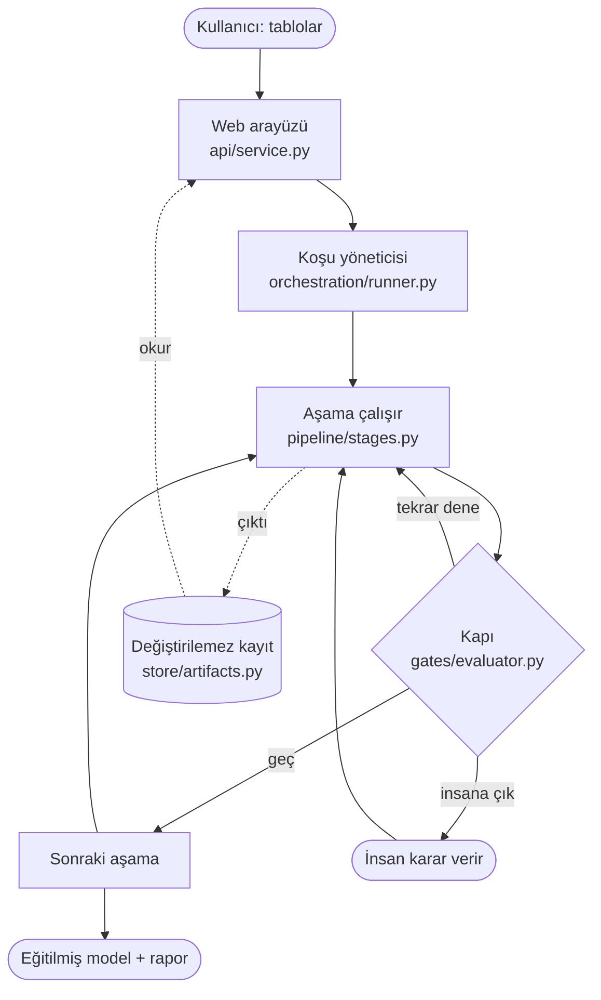
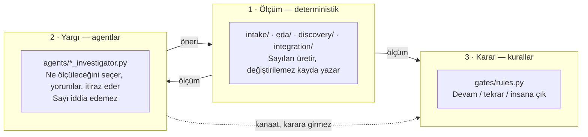
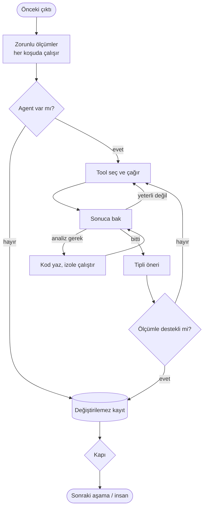

# Boruhattı Mimarisi — her adım kararını neye göre veriyor

Sisteme sıfırdan bakan biri için yazıldı. On iki aşamanın her biri hangi ölçümü
yapıyor, hangi eşiğe bakıyor, o eşik neden o değer.

---

## Genel sistem akışı

Döngünün kendisi üründür: aşama çalışır, kapı bakar, üç şeyden biri olur —
devam, tekrar dene, insana çık. **Kapı bir model değil**, aynı girdiye her zaman
aynı cevabı veren saf bir fonksiyondur.

## Üç katman

Kesikli ok kritik olan: agent'ın kanaati karar katmanına ulaşır ama kararı
değiştirmez. Agent bir sonucu değiştirmek istiyorsa ölçüm katmanına bir **test**
önermek zorundadır.

## Bir aşamanın iç döngüsü

İki koruma: zorunlu ölçümler agent ne yaparsa yapsın çalışır, ve ölçümle
desteklenmeyen öneri reddedilip döngüye geri döner.

---

# 1 · Veri alma

**Dosyalar:** `intake/loaders.py` · `intake/profiler.py` · `intake/keys.py`

Çıktı, her tablo için bir **DataCard**: şema, sütun istatistikleri, anahtar
adayları, sorun listesi. Agentların gördüğü tek veri temsili budur.

## Uyarılar tam olarak hangi koşulda veriliyor

Her uyarının sabit bir kodu vardır; arayüz ve testler ona güvenir.

| Koşul | Seviye | Kod |
|---|---|---|
| Başlık boş, `unnamed:` ile başlıyor veya `nan` | **warn** | `blank_column_name` |
| Başlık normalize edilirken değişti | info | `column_renamed` |
| Normalize sonrası iki sütun aynı ada geldi | **warn** | `duplicate_column_name` |
| Tamamı boş sütun bulundu ve atıldı | **warn** | `empty_columns_dropped` |
| Tamamı boş satır bulundu ve atıldı | info | `empty_rows_dropped` |
| Satır sayısı limiti aştı, örneklem alındı | info | `profiled_on_sample` |
| Kullanılabilir sütun yok | **error** | `no_columns` |
| Satır yok | **error** | `no_rows` |

Seviye seçimleri keyfi değil. Boş **sütunun** atılması şemayı değiştirir ve
sonraki aşamaların gördüğü tabloyu daraltır — bu yüzden `warn`. Boş **satır**
atmak yalnızca gürültü temizler — `info`. Örneklem uyarısının metni ayrıca
"benzersizlik ve anahtar tespiti yaklaşıktır" der, çünkü örneklemde benzersiz
görünen bir sütun tam veride benzersiz olmayabilir ve buna dayanan bir join
önerisi yanlış olur.

## Sütun tipi neye göre belirleniyor

Semantik tip dtype'tan değil **ölçümden** çıkar. Sıra önemlidir; ilk eşleşen
kazanır.

| Tip | Ölçülen koşul |
|---|---|
| `email` | Örneklemin **%50'sinden fazlası** e-posta kalıbına uyuyor |
| `identifier` | Uzun rakam dizisi oranı **>%80** *ve* benzersizlik yüksek |
| `boolean` | Tüm değerler `{0,1,true,false,yes,no,y,n,t,f}` kümesinde |
| `identifier` | Benzersizlik **>0.98** *veya* ayrık değer sayısı eşiği aşıyor |
| `datetime` | Değerlerin **≥%70'i** tarihe çözülüyor |
| `categorical` | Ayrık değer sayısı kategorik tavanın altında |
| `text` | Benzersizlik **≥0.5** ve yukarıdakiler tutmadı |

**Tarih eşiği neden %70:** gerçek zaman sütunları açık çöp işaretleri barındırır
(`"N/A"`, `"0000-00-00"`, boş dize). Eşik %100 olsaydı bu sütunlar metin sayılır
ve zamansal bölme imkânsız hale gelirdi. %70 toleransı sütunu zaman sütunu
olarak korur, çözülemeyen değerleri boş kabul eder.

## Anahtar adayı olma şartı

Üçü birden: **benzersiz**, **birden fazla ayrık değer**, **ve sürekli sayısal
değil**.

Üçüncüsü gereksiz görünür ama değildir. Bir ondalık ölçüm sütunu — tutar,
sıcaklık — tesadüfen tamamen benzersiz olabilir. Kodun ifadesiyle: *ayrık bir
ondalık, örneklemin bir tesadüfüdür, bir tanımlayıcı değil.* Bu şart olmasaydı
`amount` sütunu birincil anahtar adayı olarak önerilir ve sonraki join
önerilerini zehirlerdi.

---

# 2 · Şema keşfi

**Dosyalar:** `intake/keys.py` · `agents/schema_investigator.py`

İlişki tespiti tamamen deterministiktir. Modülün kendi ifadesi ayrımı koyar:
*bu modül neyin örtüştüğünü ölçer; agent bunun ne anlama geldiğine karar verir.*

## Neden tek bir örtüşme oranı yetmiyor

Her aday ilişki için **üç ayrı oran** hesaplanır:

| Ölçüm | Ne söyler | Eşik |
|---|---|---|
| `overlap_rate` | Sol tablodaki **satırların** kaçı sağda karşılık buluyor | ≥ 0.30 |
| `distinct_overlap_rate` | Sol tablodaki **ayrık değerlerin** kaçı karşılık buluyor | — |
| `parent_coverage` | Sağ tablonun kaçı kullanılıyor | ≥ 0.50 |
| `name_affinity` | Sütun adları ne kadar benziyor | ≥ 0.50 |

Satır düzeyi örtüşme yüksek ama ayrık örtüşme düşükse, birkaç sık geçen değer
bütün oranı tek başına şişiriyordur — sahte ilişki. Ebeveyn kapsaması düşükse
sağ tablonun çoğu hiç kullanılmıyordur.

**İsim benzerliği tek başına kapı olamaz.** Koddaki örnek: `provider_ref` ile
`physician_id` arasında isim benzerliği **0.0**, oysa bu gerçek bir yabancı
anahtardır. Bu yüzden isim benzerliği yalnızca sıralamaya katkıdır; kabul şartı
ölçülen örtüşmedir.

Yabancı anahtar adayı olmak için ayrıca sütunun **boşluk oranı %5'in altında**
olmalıdır. Bileşik anahtarlar en fazla **iki sütun** genişliğinde aranır.

## Agent burada ne yapar

Ölçümler hazır olduktan sonra agent hangi ilişkiyi inceleyeceğine karar verir,
ek ölçüm ister, ve önerdiği planı `trial_integration_plan` ile **gerçekten
çalıştırıp test edebilir**. Ölçümle desteklenmeyen plan reddedilir.

---

# 3 · Birleştirme

**Dosya:** `integration/executor.py`

Onaylanan plan DuckDB ile çalıştırılır. Bu aşamanın asıl işi birleştirmek değil,
**birleştirmenin ne bozduğunu ölçmektir**.

Kritik ölçüm *grain koruması*: girdi kaç satırdı, çıktı kaç satır, grain
sütunlarında tekrar eden veya boş satır oluştu mu. Bir join yanlışlıkla satır
çoğaltırsa — bire-çok bir ilişki bire-bir sanıldığında olur — bu ölçüm yakalar.
Sonraki her aşama bozulmuş tablo üzerinde çalışacağı için bu, boruhattının en
sessiz tehlikelerinden biridir.

---

# 4 · Problem tanımı

**Dosyalar:** `agents/problem_investigator.py` · `discovery/support.py`

Agent aday problemler önerir. Her aday için Python **destek ölçümü** yapar ve
sonucu adaya iliştirir; agent bu sayıları kendisi yazamaz.

Gerçek bir koşudan:

| Ölçüm | Değer | Ne için |
|---|---|---|
| `n_rows` | 20.000 | Öğrenme için yeterli veri var mı |
| `target_null_rate` | 0.0 | Hedef ne kadar dolu |
| `n_classes` | 7 | Sınıflandırma karmaşıklığı |
| `minority_class_rate` | 0.140 | Sınıf dengesizliği |
| `n_usable_features` | 6 | Kimlik ve hassas sütunlar düşüldükten sonra |
| `rows_per_feature` | 3.333 | Aşırı öğrenme riski |
| `blocking_reasons` | `[]` | Bu problem uygulanabilir mi |

`n_usable_features` önemlidir: kimlik sütunları ve hassas işaretli sütunlar
öznitelik havuzundan çıkarılır. İsim ve e-posta modele girmez — bu sızıntı
denetimine bırakılan bir şey değil, burada yapılan bir elemedir.

**Problem söylenmediyse:** koşu bu aşamada durur ve insana sorar. Sistem
kullanıcı adına problem seçmez.

---

# 5 · Doğrulama stratejisi

**Dosya:** `discovery/validation_signals.py`

Yanlış bölme, gerçekte işe yaramayan bir modelin mükemmel skor almasına yol açar
ve bu hiçbir metrikte görünmez.

Ölçülen üç sinyal:

- **Tekrarlayan kimlikler** — aynı müşteri hem eğitimde hem testte varsa model
  onu ezberler.
- **Zaman aralıkları** — veri bir zaman dilimi kapsıyorsa rastgele bölme
  geleceği eğitime sızdırır.
- **Kapsama matrisi** — bir gruplama sütunu ancak diğer tüm tekrarlayan kimlik
  alanlarını *içeriyorsa* kullanılabilir.

**Kapsama matrisi neden gerekli:** gerçek bir veri setinde ölçüldü. `review_id`
tekrar ediyor, yani ilk bakışta gruplama adayı. Ama ona göre gruplanınca tekrar
eden 3.035 müşterinin **2.721'i** hâlâ gruplar arasına yayılıyor. Gruplama
yapılmış gibi görünür, koruma sağlamaz.

Bölme stratejileri bir sıralama değil **kısmi sıra**dır: gruplanmış bölme,
zamansal bölmeden "daha güvenli" değildir; farklı bir sızıntıyı engeller. İkisi
de gerekiyorsa strateji `grouped_temporal` olur.

---

# 6 · Keşifsel analiz

**Dosyalar:** `eda/profiler.py` · `agents/eda_investigator.py`

Önce sabit profil çıkarılır ve bu **her koşuda çalışır** — agent atlayamaz.
Sonra agent, bu veriye özgü ek bir analiz faydalı olacaksa kendi Python'unu
yazıp izole konteynerde çalıştırır.

Yayınlayabildiği tek şey kodun ürettiği ve host'un doğruladığı bir
**manifest**tir: agregat grafik verisi, bağlı sütun adları, önerilen yorum,
zorunlu doğrulama sorusu. Konsol çıktısı ve referans verilmemiş dosyalar ekrana
ulaşmaz.

Agent katmanı **kapatılabilir**. Kapatınca sabit profil yine çalışır; takas
analiz ile süre arasındadır, koruma ile değil.

---

# 7 · Sızıntı denetimi

**Dosya:** `discovery/leakage.py`

Yedi bağımsız aile taranır.

| Aile | Ne arar | Eşik |
|---|---|---|
| `target_correlation` | Hedefle neredeyse aynı olan sütun | 0.95 |
| `target_mutual_information` | Doğrusal olmayan bağımlılık | kalibre |
| `perfect_separator` | Hedefi tek başına kusursuz ayıran sütun | kalibre |
| `missingness_separator` | Boşluk deseninin hedefi ele vermesi | kalibre |
| `unwindowed_aggregate` | Geleceği içeren pencereyle hesaplanmış toplam | köken |
| `post_cutoff_datetime` | Karar anından sonraki zaman damgası | köken |
| `identifier_proxy` | Kimlik gibi davranan sözde öznitelik | 0.98 |

**Eşikler tahmin edilmedi, ölçüldü.** Koddaki kalibrasyon notları bozulmuş
kopyalar üzerindeki denemeleri kaydediyor: bin satırlık bir kopyada %97,5 uyuşma
0,93–0,96 skor üretiyor, %95 uyuşma 0,86–0,93, %90 uyuşma 0,76–0,86. Eşik
0,95'te durur çünkü aşağısı meşru güçlü öznitelikleri de yakalamaya başlar.

Ayrıca bir **sayaç örnek** kayıtlı: `years_experience`'tan türetilen
`senior_physician` sütunu 1.000 skor alır ama **engelleyici değildir** — bu bir
eşikleme, sızıntı değil. Bir eşiğin doğruluğu, yalnızca yakaladıklarıyla değil
kasten yakalamadıklarıyla da gösterilir.

## Agent burada itiraz edebilir

Agent **yanlışlanabilir bir test** önerir — örneğin "bu alan tahmin zaman
damgasından önce doluyor mu". Testi sistem koşar. Sonuç agent'ı doğrulasa bile
kapı açılmaz:

| Otonomi ayarı | İtiraz yokken | İtiraz doğrulandığında |
|---|---|---|
| supervised | retry | **escalate** |
| checkpointed | retry | **escalate** |
| autonomous_with_guardrails | retry | **escalate** |
| full_auto | retry | **escalate** |

Sütun şüpheli listesinden çıkmaz. Agent'ın işi insana sorulan soruyu
daraltmaktır, cevaplamak değil.

---

# 8–12 · Üretim aşamaları

## 8 · Öznitelik üretimi
`agents/feature_investigator.py` · `ds_toolkit/`

Boşluk doldurma, kategorik kodlama, ölçekleme, tarih ayrıştırma. Kritik kural:
dönüşümler **yalnızca eğitim katlamasından öğrenilir**. Ortalamayı tüm veriden
hesaplayıp boşlukları onunla doldurmak, test verisinin bilgisini eğitime taşır.

## 9 · Bölme
`splitting/executor.py` · `splitting/diagnostics.py`

Seçilen strateji uygulanır ve *gerçekten korunup korunmadığı* ölçülür. Strateji
seçmekle stratejinin işe yaraması ayrı şeylerdir.

## 10 · Eğitim
`training/candidates.py` · `training/experiments.py` · `training/runner.py`

Birden fazla aday eğitilir ve aralarında **zorunlu bir referans model** bulunur —
her zaman en sık sınıfı ya da ortalamayı söyleyen basit bir tahminci. Referans
olmadan bir skorun iyi olup olmadığı bilinemez.

Görev tipinin bütün metrikleri hesaplanır; problemin seçtiği metrik hem
sıralamada hem raporda kullanılır. Agent model kodu yazabilir ama nihai model
onaylı bir tarifle, holdout'a erişmeden yeniden eğitilir.

## 11 · Değerlendirme
`reporting/evaluation.py`

Hiç görülmemiş veride ölçüm, referans modelle karşılaştırma, sızıntı bulguları
ve alınan kararların birlikte kaydı. Bu aşama ayrıca eğitim raporunun problem
tanımıyla tutarlı olduğunu doğrular — görev tipi, metrik ve hedef sütun
eşleşmezse koşu düşer.

## 12 · Raporlama
`reporting/markdown.py` · `training/export.py`

Okunabilir rapor ve **bağımsız bir eğitim betiği**. Betik, temiz bir
yorumlayıcıda hiçbir framework içe aktarmadan çalışıp kaydedilmiş holdout
skorunu birebir üretir.

---

# Kapı: durma kararı

**Dosyalar:** `gates/rules.py` · `gates/evaluator.py` · `gates/default_policy.yaml`

Kurallar dört katmanda değerlendirilir; **en yüksek katman önce kazanır**.

| # | Katman | Kapsadığı kurallardan |
|---|---|---|
| 1 | `HARD` | `leakage_detected` · `pii_egress_requested` · `destructive_operation` · `retry_budget_exhausted` · `repeated_identical_failure` |
| 2 | `RISK` | `risk_class_gate` · `unmet_mandatory_criteria` |
| 3 | `SIGNAL` | `model_below_baseline` · `lift_within_noise` · `high_cv_variance` · `candidate_disagreement` · `statistical_support_low` · `degenerate_split` |
| 4 | `PROFILE` | `profile_checkpoint` · `profile_requires_confirmation` |

**Sıralamanın anlamı:** kullanıcının otonomi tercihi **en zayıf** katmandır.
"Tam otomatik" seçilmiş bir koşu bile sızıntıda, kişisel veri dışa akışında ve
kaynağı değiştirecek işlemlerde durur — çünkü tercih dördüncü katmanda, bunlar
birinci katmandadır.

Kapı insana çıkarken şunları taşır: neden durulduğu, hangi kuralların
tetiklendiği, seçenekler, her seçeneğin sonucu, önerilen yol.

Eşik değerleri `gates/default_policy.yaml` dosyasındadır. Bu ayrım bir kez
pahalıya mal oldu: bir eşik dataclass varsayılanında değiştirildi ama yüklenen
politika YAML'dan okunuyordu, dolayısıyla değişiklik hiç yürürlüğe girmedi.
**Politikayı okuyan dosya YAML'dır.**

---

# Okumaya nereden başlanmalı

Üç dosya iskelettir:

1. `pipeline/workflow.py` — aşamaların sırası, her birinin ne tükettiği/ürettiği
2. `orchestration/runner.py` — döngü
3. `gates/rules.py` — durma kararı

Geri kalan her şey bu üçünün çağırdığı motorlardır.
