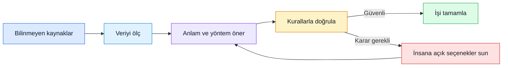
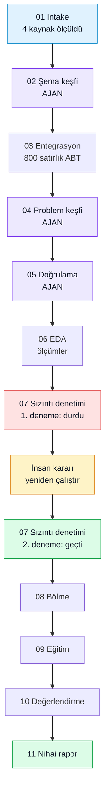
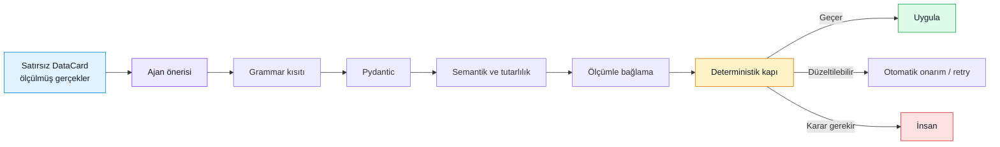

# Bilinmeyen Veriden Anlayışa ve Tamamlanmış İşe

Bu sistemin amacı yalnızca bir makine öğrenmesi modeli üretmek değildir. Kullanıcı, içeriğini henüz tanımadığı bir veri kümesini sisteme verir; aynı çalışma içinde hem verinin ne anlattığını öğrenir hem de analiz, doğrulama, modelleme ve raporlama işi tamamlanır. Karar gerektirmeyen işler ölçülebilir ve tekrarlanabilir biçimde yürütülür. İş açısından anlam taşıyan seçimler ajanlar tarafından önerilir. Güvenlik sınırı aşıldığında ise karar insana bırakılır.

Bu rapor, tamamlanmış `ui-affa867a6388` koşusunu baştan sona izleyerek bu ayrımı gösterir. Koşuda dört dağınık kaynak görünümü alındı, hekime ait tek satırlık bir analitik tablo kuruldu, ücret tahmini problemi seçildi, veri sızıntısı nedeniyle çalışma durdurulup insana taşındı ve insanın yeniden çalışma kararından sonra model ile nihai rapor üretildi.

## 1. Ajanları nerede ve nasıl kullandık?

Bu koşuda on bir aşamanın yalnızca üçünde ajan karar verdi:

- **Şema keşfi ajanı**, hangi tablonun analitik tablonun temeli olacağını, tabloların hangi anahtarlarla bağlanacağını ve hangi kaynakların önce özetlenmesi gerektiğini önerdi.
- **Problem keşfi ajanı**, veride gerçekten desteklenen bir iş problemini seçti: yıllık hekim ücretini tahmin eden bir regresyon problemi ve başarı ölçütü olarak RMSE.
- **Doğrulama stratejisi ajanı**, başlangıç ayarındaki rastgele bölme tercihine rağmen zaman bilgisini dikkate alarak `hire_date` sıralı, beş katlı zamansal doğrulama önerdi.

Ajanlar hesap makinesi ya da veri işleme motoru olarak kullanılmadı. Satırları görmediler; ölçülmüş ve satır içermeyen DataCard özetleri üzerinden anlam ve yöntem önerdiler. Dört tablo için ajana giden bağlam yaklaşık 594 token idi. Sayıları Python hesapladı, birleştirmeleri DuckDB yürüttü, sızıntıyı deterministik denetimler aradı, modelleri eğitim kodu kurdu ve durma kararını kapılar verdi.

Bu ayrım önemlidir: ajan, “Bu tabloyu şu anlamda kullanmak mantıklı görünüyor” diyebilir; fakat ölçülmemiş bir anahtarı, korelasyonu ya da örneklem büyüklüğünü gerçekmiş gibi yazamaz. Öneri geçerli sözleşmeye uymuyorsa veya ölçümle desteklenmiyorsa deterministik katman onu reddeder.

## 2. Sistem bunu nasıl teslim ediyor? Tek koşunun baştan sona hikâyesi

Koşunun omurgası [orchestration/runner.py](../src/ads/orchestration/runner.py) içindedir. Her aşamayı çalıştırır, çıktıyı kapıya gönderir ve sonuç `proceed`, `retry` ya da `human` olana kadar aynı döngüyü yönetir. Her kalıcı çıktı [store/artifacts.py](../src/ads/store/artifacts.py) tarafından içeriğine göre adreslenen, değiştirilemez bir artefakt olarak saklanır. Böylece kullanıcı yalnız sonucu değil, sonuca giden yolu da inceleyebilir; yarıda kalan koşu aynı kanıtlardan sürdürülebilir.

### 01 — Intake: veri daha modellenmeden anlaşılmaya başlar

[intake/loaders.py](../src/ads/intake/loaders.py) farklı dosya biçimlerini okur ve ayrıştırma sırasında yapılan düzeltmeleri kaydeder. [intake/profiler.py](../src/ads/intake/profiler.py) her kaynak için satır sayısı, sütun türleri, boşluklar ve güvenli dağılım özetlerinden bir DataCard üretir; kaynak satırlarını ajana taşımaz. [intake/keys.py](../src/ads/intake/keys.py) olası anahtarları ve tablolar arası örtüşmeyi ölçer.

**Makine ne ölçtü?** Dört kaynak görünümünün yapısını, anahtar adaylarını ve ilişkilerini çıkardı. Örneğin `ledger_2019_2024.provider_ref` değerlerinin yüzde 5,8’inin `physician_id` ile eşleşmediğini buldu.

**Ajan neye karar verdi?** Bu aşamada ajan yoktu.

**Kullanıcı ne öğrendi?** Daha model kurulmadan, defter kayıtlarının bir bölümünün hekim tablosuna bağlanamayacağını; bu kayıtların analitik tablodan dışarıda kalacağını ve bunların hekim olmayan tedarikçiler ya da veri giriş hataları olabileceğini öğrendi. Bu yalnızca “kalite uyarısı” değil, kaynak sistemin işleyişi hakkında doğrulanabilir bir bulgudur.

**İnsan kararı gerekli miydi?** Hayır. Bulgular ve sonuçları kayda geçirildi; çalışma devam etti.

### 02 — Şema keşfi: dağınık tablolar bir analiz planına dönüşür

[agents/schema_discovery.py](../src/ads/agents/schema_discovery.py), satırlar yerine DataCard’ları okuyarak tabloların işlevini, tane düzeyini ve güvenli birleşim sırasını yorumlar.

**Makine ne ölçtü?** Anahtar örtüşmelerini, kaynakların tane düzeylerini ve birleştirme öncesi çoğalma riskini hazır etti.

**Ajan neye karar verdi?** “`physicians__physician_master` tablosunu `physician_id` başına bir satır olacak şekilde temel al; üç join’den önce iki aggregation uygula.” önerisini üretti.

**Kullanıcı ne öğrendi?** Kaynakların aynı şeyi temsil etmediğini gördü: hekim tablosu kişi düzeyindeyken işlem ve defter tabloları olay düzeyindeydi. Bu nedenle onları doğrudan bağlamak satırları çoğaltacaktı; önce hekim başına özetlemek gerekiyordu.

**İnsan kararı gerekli miydi?** Hayır. Plan ölçülmüş anahtarlarla desteklendiği için kabul edildi.

### 03 — Entegrasyon: plan gerçekten uygulanır ve tane düzeyi doğrulanır

[integration/](../src/ads/integration/) altındaki yürütücü, ajan önerisini DuckDB sorgularına çevirir; toplulaştırmaları ve join’leri çalıştırır. İşlem tablosundaki 15.000 satır ve 800 hekim gibi kaynak ölçümlerinden başlayarak analitik temel tabloyu üretir.

**Makine ne ölçtü?** Sonucun 800 satır ve 17 sütundan oluştuğunu, her `physician_id` için bir satır bulunduğunu doğruladı. Join sonrasında beklenmeyen tane değişimi olup olmadığını kontrol etti.

**Ajan neye karar verdi?** Yeni bir karar vermedi; önceki plan yürütüldü.

**Kullanıcı ne öğrendi?** Analizin artık “bir işlem” değil “bir hekim” hakkında olduğunu ve olay tablolarının hekim düzeyinde özetlendiğini öğrendi.

**İnsan kararı gerekli miydi?** Hayır. Ölçülen tane, planlanan tane ile uyumluydu.

### 04 — Problem keşfi: yapılabilir iş problemi seçilir

[discovery/support.py](../src/ads/discovery/support.py), bir hedefin gerçekten modellenebilir olup olmadığını örnek sayısı, hedef doluluğu ve kullanılabilir özellikler üzerinden deterministik olarak ölçer. [agents/problem_discovery.py](../src/ads/agents/problem_discovery.py) ise desteklenen adaylar arasından iş açısından anlamlı problemi önerir.

**Makine ne ölçtü?** Seçilen hedef için 712 kullanılabilir satır, yüzde 11 hedef boşluğu ve 11 kullanılabilir özellik bulunduğunu belirledi. Hedefi eksik 88 satırın eğitimde kullanılamayacağı görünür hale geldi.

**Ajan neye karar verdi?** “Physician Compensation Forecasting” problemini seçti: `annual_comp` hedefli regresyon ve ölçüt olarak RMSE.

**Kullanıcı ne öğrendi?** Verinin hangi işi desteklediğini, kaç satırın bu iş için kullanılabildiğini ve hedef eksikliğinin veri kapsamını nasıl azalttığını öğrendi.

**İnsan kararı gerekli miydi?** Bu koşuda hayır. Ajanın seçimi deterministik fizibilite sınırları içinde kaldı.

### 05 — Doğrulama stratejisi: modelin nasıl sınanacağı belirlenir

[discovery/validation_signals.py](../src/ads/discovery/validation_signals.py) tekrarlanan varlıkları, zaman aralıklarını ve bir gruplama anahtarının diğer tekrar eden kimlikleri gerçekten kapsayıp kapsamadığını ölçer. [agents/validation_strategy.py](../src/ads/agents/validation_strategy.py) bu sinyallerden güvenli doğrulama tasarımını önerir.

**Makine ne ölçtü?** `hire_date` alanının 2005–2022 dönemini kapsadığını ve bu analitik tabloda tekrarlanan varlık anahtarı bulunmadığını gösterdi.

**Ajan neye karar verdi?** Başlangıçtaki rastgele bölme tercihinin yerine `hire_date` ile sıralanmış, beş katlı zamansal doğrulama ve yüzde 20 dış test önerdi. Dış test sınırı 2021-01-01 oldu.

**Kullanıcı ne öğrendi?** Başarıyı geçmişten geleceğe genelleme olarak sınamak gerektiğini, rastgele karıştırmanın bu kullanım bağlamını temsil etmeyeceğini öğrendi.

**İnsan kararı gerekli miydi?** Hayır. Öneri ölçülmüş zaman sinyaliyle desteklendi.

### 06 — EDA: modelden önce verinin davranışı görünür olur

[eda/profiler.py](../src/ads/eda/profiler.py) hedef dağılımını, boşlukları, korelasyonları, aykırı değerleri ve diğer dağılım özetlerini hesaplar.

**Makine ne ölçtü?** `annual_comp` alanında 88 boş değer, yani yüzde 11 eksiklik bulunduğunu; `total_comp_ytd` ile hedef arasındaki korelasyonun yaklaşık 0,995, `years_experience` ile yaklaşık 0,938 olduğunu gösterdi.

**Ajan neye karar verdi?** Bu aşamada ajan yoktu; ölçümler yorum için hazırlandı.

**Kullanıcı ne öğrendi?** Hedefin kapsamını, hangi alanların hedefle çok güçlü birlikte hareket ettiğini ve sonraki sızıntı denetiminde özellikle hangi ilişkilerin sorgulanması gerektiğini öğrendi.

**İnsan kararı gerekli miydi?** Hayır. EDA bir karar vermedi; kanıt üretti.

### 07 — Sızıntı denetimi: sistemin insanı gerçekten devreye aldığı an

[discovery/leakage.py](../src/ads/discovery/leakage.py) yedi sızıntı ailesini deterministik olarak tarar. Yalnız yüksek skor aramaz; alanın ne zaman oluştuğu, toplulaştırmanın hangi zaman penceresini kullandığı ve hedefe yapısal yakınlığı gibi nedenleri de denetler.

İlk denemede altı engelleyici bulgu çıktı. Beş toplulaştırılmış alan — `avg_txn_amount`, `ledger_entry_count`, `total_ledger_amount`, `total_txn_amount` ve `txn_count` — zamansal bölme kullanılmasına rağmen tüm geçmişten hesaplanmıştı. Bunlar yalnız korelasyonla bulunamazdı; veri kökeni ve pencere bilgisi sayesinde yakalandı. Ayrıca `total_comp_ytd` ile hedef arasındaki korelasyon 0,994768 idi ve 0,95 sınırını aşıyordu.

[gates/rules.py](../src/ads/gates/rules.py) bulguları politika kurallarına çevirdi; [gates/evaluator.py](../src/ads/gates/evaluator.py) ve [gates/default_policy.yaml](../src/ads/gates/default_policy.yaml) birlikte `leakage_detected` ve `retry_budget_exhausted` kurallarını tetikledi. Sonuç `reason_code=leakage_unresolved` oldu. Model ya da ajan, “Bu kadar sızıntı kabul edilebilir” diyerek devam edemedi.

İnsana yalnız “bir sorun var” denmedi. Şu bağlam gösterildi:

> Why this stopped:
> - Leakage at correlation 0.995 persists after 1 attempts. Human review required.
> - Stage `leakage_audit` has used 1 of 1 attempts without passing. Human input needed.

Üç seçenek sunuldu:

1. Onayla ve devam et.
2. Yeniden çalışma için geri gönder — önerilen seçenek.
3. Koşuyu durdur.

İnsan ikinci seçeneği seçti. Sorunlu altı alan özellik listesinden çıkarıldı ve aşama ikinci kez çalıştırıldı. İkinci denetim beş özelliği kontrol etti, sızıntı bulgusu üretmedi ve geçti.

Bu an sistemin temel çalışma biçimini tek başına gösterir: deterministik ölçüm görünmeyen bir yöntem hatasını buldu; ajan kendi önerisinin hakemi olamadı; insan, belirli bir sorun, etkisi ve açık seçeneklerle karar verdi. Otomasyon insan kararını ortadan kaldırmadı, kararın hazırlanması için gereken işi yaptı.

### 08 — Bölme: kabul edilen doğrulama tasarımı veriye uygulanır

[splitting/](../src/ads/splitting/) zamansal stratejiyi çalıştırır ve eğitim/test sınırlarını tanı ölçümleriyle kontrol eder.

**Makine ne yaptı?** Satırları `hire_date` sırasına göre ayırdı ve modellemeye sızıntı denetiminden geçmiş özelliklerle devam etti.

**Ajan neye karar verdi?** Yeni karar vermedi; onaylanmış strateji uygulandı.

**Kullanıcı ne öğrendi?** Modelin başarısının, daha yeni işe giriş tarihlerini temsil eden ayrılmış veride sınandığını öğrendi.

**İnsan kararı gerekli miydi?** Hayır. Ancak bu aşamanın bugün önemli bir kayıt eksiği vardır: ayrı bir splitting artefaktı kalıcılaştırılmıyor.

### 09 — Eğitim: aday modeller aynı kanıt zemini üzerinde karşılaştırılır

[training/](../src/ads/training/) dönüşümleri eğitim verisine uydurur, aday modelleri çalıştırır ve fitted pipeline’ı kalıcılaştırır.

**Makine ne ölçtü?** Hedefi boş 88 satırı dışarıda bırakarak 712 satır üzerinde DummyRegressor ile Ridge’i karşılaştırdı. Ridge seçildi; ayrılmış testte RMSE 25.371,128, temel modelde 87.811,847 ve R² 0,915871 ölçüldü.

**Ajan neye karar verdi?** Model seçmedi. Seçim, önceden belirlenmiş ölçüte göre yapıldı.

**Kullanıcı ne öğrendi?** Modelin basit bir temel yaklaşımdan ne kadar daha iyi olduğunu ve sonucun hangi satır kapsamına dayandığını öğrendi.

**İnsan kararı gerekli miydi?** Hayır. Karşılaştırma aynı bölme ve aynı ölçüt üzerinde deterministikti.

### 10 — Değerlendirme: skor, süreç kanıtıyla birlikte okunur

[reporting/evaluation.py](../src/ads/reporting/evaluation.py) model performansını, temel model karşılaştırmasını ve koşu boyunca oluşan güvenlik kanıtlarını tek değerlendirme artefaktında toplar.

**Makine ne ölçtü?** Kalıcılaştırılmış modelin ölçülen fitted modelle eşleştiğini ve raporlanan performansın aynı modelden geldiğini doğruladı.

**Ajan neye karar verdi?** Bu aşamada ajan yoktu.

**Kullanıcı ne öğrendi?** Yalnız bir skor değil, o skoru üreten modelin, bölmenin ve sızıntıdan arındırılmış özellik setinin aynı zincire ait olduğunu gördü.

**İnsan kararı gerekli miydi?** Hayır; kritik insan kararı daha önce sızıntı kapısında verilmişti.

### 11 — Rapor: yapılan iş ve öğrenilenler tek teslimata dönüşür

[reporting/](../src/ads/reporting/) altındaki raporlama kodu problem tanımını, entegrasyon planını, veri bulgularını, doğrulama yaklaşımını, insan müdahalesini ve model sonucunu nihai raporda birleştirir.

**Makine ne yaptı?** On bir aşamadaki değiştirilemez artefaktlardan izlenebilir bir sonuç oluşturdu.

**Ajan neye karar verdi?** Yeni bir karar vermedi; daha önceki öneriler ve ölçümler raporlandı.

**Kullanıcı ne kazandı?** Koşunun başında bilmediği veri yapısını artık okuyabiliyor; hangi kayıtların dışarıda kaldığını, analitik tablonun neyi temsil ettiğini, hangi problemin neden seçildiğini, modelin nasıl sınandığını, hangi sızıntının yakalandığını ve nihai performansın ne olduğunu görebiliyor. Aynı zamanda kullanılabilir bir model ve değerlendirme raporu teslim alıyor.

**İnsan kararı gerekli miydi?** Rapor aşamasında hayır. İnsan kararının sonucu, koşunun akışına uygulanmış durumdaydı.

## 3. Ajanlar ne yapıyor ve bunu nasıl yapıyor?

Ajanların görevi ölçüm üretmek değil, ölçülmüş gerçekler arasından anlamlı bir öneri kurmaktır. Üç ajan aynı güvenlik düzeni içinde çalışır:

1. **Dar ve satırsız bağlam alırlar.** Kaynak verinin kendisi yerine DataCard’ları görürler. Bu hem mahremiyet sınırını korur hem de kararın hangi özete dayandığını belirginleştirir.
2. **Sözleşmeye bağlı çıktı üretirler.** Çıktı şemasında ölçüm yazabilecek alan yoktur. Ajan tablo, hedef, doğrulama biçimi veya gerekçe önerebilir; satır sayısı ya da korelasyon uyduramaz. Ölçümleri Python sonradan bağlar.
3. **Dört katmanlı kontrolden geçerler.** [agents/base.py](../src/ads/agents/base.py) dilbilgisi kısıtlı üretimden sonra Pydantic yapı doğrulamasını, anlamsal doğrulamayı, yürütülebilirlik/tutarlılık kontrollerini uygular. Güvenli ve açık hataları deterministik olarak onarır; kalan hata için, hata metnini taşıyan düzeltici bir yeniden deneme yapar.
4. **Önerileri veto edilebilir.** Ölçülmüş bir ilişkiyle desteklenmeyen join veya fizibilite sınırını karşılamayan problem uygulanmaz. Ajanın ikna edici açıklaması, eksik kanıtın yerini tutmaz.
5. **İnsana ne zaman gidileceğini ajan belirlemez.** `gates/` saf bir fonksiyon gibi artefaktı ve politikayı değerlendirir. Böylece aynı kanıt aynı kapı sonucunu üretir; ajan kendi işini onaylayamaz.

### Bugünkü açık sınırlar

Sistem, ölçümleri ve karar gerekçelerini üretmekte vaat edilen yolun önemli bir bölümünü gerçekleştiriyor; fakat henüz bütün anlayışı kullanıcıya en iyi biçimde sunmuyor.

- Yeni comprehension katmanı, ölçüme bağlı ve doğrulama sorusu taşıyan önerilmiş yorumlar üretebiliyor; ancak bu yorumlar mevcut analiz panellerine henüz yerleştirilmedi. Bugünkü arayüz ölçümleri iyi gösteriyor, fakat “Bu veri iş açısından ne düşündürüyor?” sorusunu her aşamada henüz yanıtlamıyor.
- Splitting aşaması çalışıyor ve sonraki aşamalar onun sonucunu kullanıyor, ancak kendine ait kalıcı bir artefakt kaydetmiyor. Bu, izlenebilirlik zincirinde açık bir boşluktur.
- İnsan kararı koşu akışında etkili olsa da değerlendirme artefaktında karar yetkisi `unrecorded` olarak kalabiliyor. İnsan müdahalesinin yalnız zaman çizelgesinde değil, nihai kanıt zincirinde de eksiksiz taşınması gerekir.

Dolayısıyla ürünün bugünkü dürüst tarifi şudur: sistem bilinmeyen veriyi ölçer, yapısını kurar, uygulanabilir problemi ve doğrulama yöntemini önerir, güvenli sınırlar içinde işi tamamlar ve kritik belirsizlikte insana somut bir karar verir. Bir sonraki değer artışı, zaten üretilen bu kanıtların daha güçlü alan yorumlarıyla mevcut panellerde buluşmasıdır.
