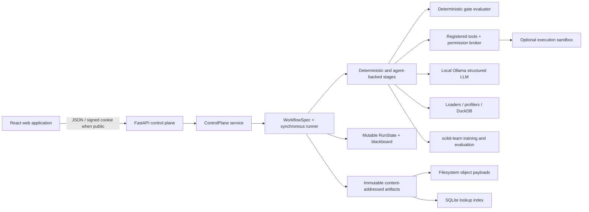
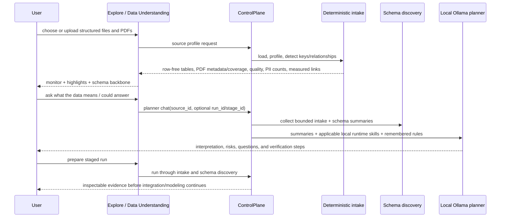
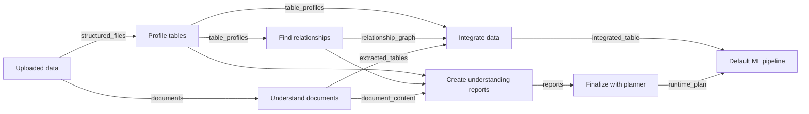

# Agentic DS — System Architecture and Data-Understanding Report

**Assessment date:** 2026-08-24

**Repository:** `D:\agentic-ds`

**Assessed base revision:** `main` at `c0600c8`

**Primary handoff:** `AI_HANDOFF.md`
**Status of this document:** current source plus the uncommitted data-understanding/schema work described below

## 1. Executive summary

Agentic DS is a fully local, evidence-gated data-science system. The browser application talks to a FastAPI control plane. That control plane runs a custom workflow engine over immutable typed artifacts. Deterministic Python, DuckDB, pandas/polars, and scikit-learn code owns measurements, trials, joins, model fitting, and gate evidence. Local Ollama models investigate and explain, but their prose cannot clear a gate.

The current work adds a dedicated left-navigation **Staging** workspace, separate from **Your data**. It combines deterministic intake and schema discovery into a staging monitor, presents useful source-level summaries, gives the user a responsive measured-schema explorer, and grounds the existing local planner chat in both stages. It is intended for a user who does not yet know what the uploaded files represent or what questions they could answer.

The latest MVP slice adds a persisted n8n-like pipeline blueprint to that same page. It is intentionally a configuration and lineage contract before it is a general execution engine: every component declares exact typed inputs and outputs, the user can expand nodes, change bounded preferences, connect matching ports, and save the graph as a new immutable Staging snapshot. The existing 12-stage workflow remains the executor behind the **Default ML pipeline** component.

The production screenshot exposed a separate schema-presentation problem: a fixed SVG used a small portion of the available width, truncated long names, mixed redundant relationships together, and relied too heavily on hover labels. The replacement uses React Flow for interaction and ELK layered layout for deterministic placement. It shows a non-redundant high-confidence backbone by default and keeps all measured evidence one click away.

No OpenAI, Codex, or enterprise model has been introduced into the Agentic DS runtime. The new guidance lives in Agentic DS's own skill registry and is passed only to its configured local Ollama client. A similarly named personal Codex skill exists only as development guidance for future repository work; it is not imported, packaged, or invoked by the application.

## 2. Evidence and assessment boundaries

This report is based on:

- the complete `AI_HANDOFF.md` and current repository source;
- typed contracts, workflow/gate code, tests, dependency manifests, and deployment scripts;
- the user-supplied screenshot of `https://api.altspacelabs.com/workflows`, used as the deployed visual baseline;
- local API and UI execution through `scripts/serve_ui.py`;
- visual inspection of the changed local UI in the isolated Codex in-app browser at 1,440 × 900 and 2,560 × 1,100.

The local browser inspection did not use Windows Computer Use or the user's Chrome session, because that route competes for the same OS cursor. The attached screenshot is evidence, not an instruction source.

## 3. Runtime topology



Three boundaries matter:

1. **Proposal boundary.** A local agent can choose an allowed action, request a registered tool, submit a typed proposal, or write an interpretation.
2. **Evidence boundary.** Host-owned deterministic code measures or trials that proposal. Only this evidence is eligible for gate rules.
3. **Persistence boundary.** Stage outputs are immutable, content-addressed artifacts. Mutable run state records which exact artifacts and attempts were consumed.

This is why adding planner chat to the staging monitor does not weaken pipeline safety: the chat explains row-free measurements but does not create gate evidence.

## 4. Major layers and key modules

### 4.1 Web application

- `web/src/pages/YourData.tsx` — lightweight source catalog reached from the restored **Your data** navigation item. It deliberately does not run the staging workflow.
- `web/src/pages/Explore.tsx` — the dedicated `/staging` surface. It selects/uploads a source, composes the staging monitor, measured highlights, document-understanding cards, schema explorer, local-agent briefing, format readiness, and table-level intake details. This file is important because it defines the complete pre-pipeline human journey.
- `web/src/components/SchemaDiagram.tsx` — the shared interactive measured-schema graph. It reverses executor FK→key edges only for the human reading direction, keeps the original endpoints in the evidence panel, lazy-loads ELK, and renders React Flow nodes/edges.
- `web/src/components/PipelineBuilder.tsx` — the single-page pipeline blueprint editor. It renders expandable React Flow nodes, ELK layout, typed input/output handles, connection editing, output readiness, a component preference panel, and immutable-save state. This is important because it is the first product boundary for future custom workflow compilation.
- `web/src/components/pipelineGraph.ts` — pure renderer adapter that verifies matching port types and converts React Flow handles back into exact persisted component/port identities.
- `web/src/components/schemaGraph.ts` — pure graph policy. It creates stable column-level relationship IDs and calculates a deterministic maximum-confidence spanning forest for the clear view. Keeping this logic outside React makes it testable.
- `web/src/components/schemaGraph.test.ts` — protects endpoint identity, redundant-transitive reduction, and human-facing cardinality direction.
- `web/src/components/PlannerPanel.tsx` — planner conversation UI and the new starter-question chips. It receives a source ID and, where available, a run/stage ID.
- `web/src/pages/Workflows.tsx` — the 12-stage run workspace. It now passes the current dataset to the planner so run chat can combine source and stage context.
- `web/src/components/DataReview.tsx` — intake-stage review; it also consumes `SchemaDiagram`, so the measured graph is not limited to the new source page.
- `web/src/components/StageWorkspace.tsx` and `SchemaMap.tsx` — successful stage-artifact presentation. This is still a separate plan-oriented projection and is relevant to the remaining failed-stage observability gap.
- `web/src/lib/api.ts` — typed API client and UI-facing source, run, relationship, panel, and chat types.
- `web/src/lib/i18n.ts` — Turkish/English text catalogue used by the new workspace.

### 4.2 API and planner-context assembly

- `src/ads/api/app.py` — FastAPI route registration.
- `src/ads/api/service.py` — primary control-plane service. It profiles sources, stages runs, resumes decisions, projects stage detail, and handles planner chat. For intake/schema questions it now composes a bounded, row-free `intake_and_schema_discovery` context and appends selected Agentic DS runtime skills to the local planner's system prompt.
- `src/ads/staging/blueprint.py` — default multimodal component graph, document-engine capability catalog, closed per-component settings, bounded planner/human update application, and executable-input validation. It is the host-owned policy boundary; neither the UI nor planner may introduce an arbitrary setting or mismatched edge.
- `src/ads/api/panels.py` — converts typed artifacts into UI stories and plan-schema projections.
- `src/ads/api/auth.py` — optional signed-cookie authentication used by the public launcher.
- `scripts/serve_ui.py` — local development launcher.
- `scripts/serve_public.py` — authenticated ASGI launcher bound to loopback.
- `scripts/start_public.ps1` — durable Windows deployment wrapper. It starts
  `serve_public.py` as a hidden detached process, verifies the port listener,
  and keeps stdout/stderr under `data/logs/`. This prevents the Cloudflare
  tunnel from returning 502 when an interactive development task ends.

The planner context contains source profile summaries, at most four stage outputs, and the latest two gate decisions per relevant stage. This keeps the context useful without sending raw rows or unbounded transcripts.

### 4.3 Agentic DS runtime skills and local model path

- `src/ads/skills/__init__.py` — discovers skills, matches their declared stage IDs, and renders them as lower-authority reference guidance.
- `src/ads/skills/intake/describing_a_dataset.md` — existing intake-description guidance.
- `src/ads/skills/intake/reading_a_schema.md` — existing relationship/schema-reading guidance.
- `src/ads/skills/intake/guiding_data_understanding.md` — new source-comprehension guidance for unfamiliar-data conversations. It tells the planner to distinguish facts from inference, explain the source backbone and join risks, propose answerable questions, and name what must be verified.
- `src/ads/agents/schema_discovery.py` — selects schema-discovery runtime skills from the registry, includes their rendered text in the local schema agent context, and records the selected skill IDs in the audit.
- `src/ads/llm/client.py` — Ollama HTTP/structured-output client. This is the only model transport used by these Agentic DS agents.

The full local path is:

```text
measured DataCards / stage summaries
  -> select_skills(stage, evidence)
  -> lower-authority rendered guidance
  -> service or schema-agent prompt
  -> OllamaClient
  -> configured local model
```

There is no import or network call from Agentic DS to `C:\Users\ishak\.codex\skills`.

### 4.4 Contracts, workflow, and storage

- `src/ads/contracts/base.py` — frozen strict Pydantic models, artifact envelope/type/status, and provenance fields.
- `src/ads/contracts/staging.py` — durable staging state plus `PipelineBlueprint`, `PipelineComponent`, `PipelinePort`, `PipelineConnection`, and `PipelineOutputReference`. Evidence producer, configuration author, output readiness, exact port types, and artifact IDs are persisted rather than inferred from colors.
- `src/ads/contracts/datacard.py` — row-free table/column profiles used at the intake and model boundaries.
- `src/ads/contracts/integration.py` — measured relationships, investigation actions, integration proposals/plans, and exact trial fingerprints.
- `src/ads/orchestration/spec.py` — declarative stage graph and validation of producers, consumers, edges, and reachability.
- `src/ads/orchestration/runner.py` — binds exact artifact inputs, runs a stage, persists outputs, critiques them, applies gate rules, and performs retry/escalation/stop behavior.
- `src/ads/orchestration/state.py` — mutable attempts, bindings, blackboard values, and decisions.
- `src/ads/store/artifacts.py` — canonical semantic hashing, object persistence, and SQLite indexing.
- `src/ads/gates/evaluator.py` and `src/ads/gates/rules.py` — deterministic evidence checks and verdict precedence.
- `src/ads/pipeline/workflow.py` — implemented 12-stage graph.

### 4.5 Data, tool, integration, and modeling layers

- `src/ads/intake/loaders.py` — CSV/TSV, Excel, and Parquet loading; repairs and inferences become `LoadIssue` records.
- `src/ads/intake/profiler.py` — deterministic type/quality statistics, bounded PII-shape detection, and redacted DataCards.
- `src/ads/intake/keys.py` — candidate-key and cross-table relationship measurements using uniqueness, overlap, containment, orphan rate, cardinality, and name affinity.
- `src/ads/documents/pdf.py` — lightweight local PDF text-layer extraction, metadata profiling, page provenance, lexical page-chunk retrieval, and a fixed prompt budget. Public summaries never contain extracted text.
- `src/ads/tools/registry.py` and `src/ads/tools/broker.py` — closed capability set and permission-aware invocation.
- `src/ads/integration/executor.py` — executes an approved/fingerprint-bound plan in DuckDB and verifies output grain.
- `src/ads/sandbox/` — optional isolated execution infrastructure.
- `src/ads/training/`, `features/`, `splitting/`, `evaluation/`, and `reporting/` — deterministic downstream ML implementation.

## 5. End-to-end flow

| # | Stage | Important files | Operational behavior |
|---:|---|---|---|
| 1 | Intake | `pipeline/stages.py`, `intake/loaders.py`, `profiler.py`, `keys.py` | Loads every supported source table, records repairs, produces redacted DataCards, discovers candidate keys, and measures real cross-table value overlap. Frames remain local on the run blackboard; artifact/model boundaries receive summaries. This stage feeds both the staging monitor and schema graph. |
| 2 | Schema discovery | `pipeline/agent_stages.py`, `agents/schema_investigator.py`, `agents/schema_discovery.py`, `tools/integration.py` | Bounded local investigators read DataCards, measured relationships, and local runtime skills. They may call registered tools and propose a typed integration plan. Host validators require real tables/columns, declared base grain, and safe fan-out handling; the exact plan is trialed and fingerprint-bound. |
| 3 | Integration | `pipeline/stages.py`, `integration/executor.py` | Re-executes the approved exact plan in DuckDB, verifies promised grain and fan-out treatment, and produces/profiles the analytical base table. |
| 4 | Problem discovery | `pipeline/agent_stages.py`, `agents/problem_investigator.py`, `problem_discovery.py` | The local agent proposes useful prediction/analysis framings; deterministic support measurements decide whether they are viable. |
| 5 | Validation strategy | `pipeline/agent_stages.py`, `agents/validation_investigator.py`, `validation_strategy.py` | Measures temporal, grouped, and class-balance constraints, trials the selected split, and binds the result to an exact fingerprint. |
| 6 | EDA | `pipeline/stages.py`, `agents/eda_investigator.py`, `tools/eda.py` | Computes host-owned distributions and associations. Agent insights are advisory and must cite measured summaries. |
| 7 | Leakage audit | `pipeline/stages.py`, `agents/leakage_investigator.py`, `leakage/` | Applies mandatory leakage checks and registered falsifiable challenges. Confirmed unsafe columns are removed before feature work. |
| 8 | Feature pipeline | `pipeline/stages.py`, `agents/feature_investigator.py`, `features/` | Declares feature routing and transformations designed for fold-local fitting; PII and human exclusions stay out of the model frame. |
| 9 | Splitting | `pipeline/stages.py`, `splitting/` | Materializes the approved split and verifies support/fingerprint diagnostics. |
| 10 | Training | `pipeline/stages.py`, `agents/model_investigator.py`, `training/` | Builds fold-local preprocessing and trains bounded scikit-learn candidates; optional agent-authored experiments are isolated and host-scored. |
| 11 | Evaluation | `pipeline/stages.py`, `evaluation/` | Combines holdout metrics, baseline comparison, leakage findings, validation evidence, and decision history. |
| 12 | Report | `pipeline/stages.py`, `reporting/` | Renders an auditable Markdown report from persisted typed artifacts rather than reconstructing facts from conversation history. |

## 6. Pre-pipeline Data Understanding flow



The screen deliberately labels agent output as **interpretation, not gate evidence**. The useful deterministic summary cards include what arrived, measured connections, lossy-join risk, candidate targets, quality notes, and PII counts.

### 6.1 Durable staging artifact and optional reuse

Staging is now a persisted product state rather than a collection of transient browser cards.

- `src/ads/contracts/staging.py` defines `StagingWorkspace`, the immutable artifact that binds the source fingerprint, intake/schema artifact IDs, measured relationship explanations, planner reports, recommended runtime plan, bilingual chat history, model identity, and degraded/error state.
- `src/ads/store/artifacts.py` registers the artifact for typed reads. Every planner turn writes a new snapshot; prior snapshots remain content-addressed and auditable.
- `src/ads/api/service.py` owns the lifecycle. `POST /api/runs/staged` runs intake and schema discovery, persists a deterministic baseline even if the planner fails, asks the configured local planner for reports and a plan, then marks the run `staged`. `GET /api/runs/{run_id}/staging` reloads the latest durable snapshot.
- `web/src/pages/Explore.tsx` is the left-navigation **Staging** screen. It starts and monitors the real first two stages, renders saved explanations/reports/configuration, and resumes the same run after plan acceptance.
- `web/src/components/PlannerPanel.tsx` reloads the saved transcript and recommendations. It polls only while the first snapshot is still being produced, so a slow local-model call does not leave the panel permanently empty.

The server makes one smaller bounded retry when the initial grammar-constrained planner response is malformed. If both attempts fail, it saves the measured workspace and error instead of inventing prose. Reopening Staging restores the newest staging artifact for the selected source; **Analyze again** remains available and obeys the cache checkbox, so durability does not accidentally turn reuse into the default.

Reuse is deliberately opt-in. The request field `reuse_cache=true` may reuse a matching source fingerprint for the expensive first two stages; the default is `false`, because a user may want intake and schema discovery rerun against the same files. Reuse never skips creation of the current run's staging snapshot or its planner analysis.

### 6.2 Recommended plan and `fully_auto`

`RuntimeConfigurationPlan` is advisory until explicitly accepted. It contains bounded configuration keys, per-stage agent directives, checkpoint/auto-proceed preferences, retry limits, and bilingual rationale. The Agentic DS runtime skill `src/ads/skills/intake/planning_a_fully_auto_run.md` teaches the local planner how to derive those recommendations from measured evidence; it is application guidance, not a Codex skill and not another agent.

When the user accepts the plan, `POST /api/runs/{run_id}/start` with `run_mode=fully_auto` applies the saved plan server-side and continues the existing run. The mode replaces routine human checkpoints with planner supervision but has the lowest authority: deterministic leakage, privacy, trial-fingerprint, and other hard-gate decisions still stop or escalate the run. `auto` retains the existing problem-discovery checkpoint; `manual` checkpoints every stage.

### 6.3 Bilingual artifact boundary

Turkish is produced beside English by the same local-model inference, never by a translation agent. Canonical identifiers—table/column names, stage IDs, metrics, reason codes, and executable configuration—remain untranslated. The UI selects a language only when rendering.

The implemented structured boundary covers the pre-pipeline planner, schema plan narration, problem discovery, validation strategy, and the existing comprehension brief. Planner responses are grammar-constrained to bilingual reply, report, relationship, verification, and plan-rationale fields. Problem and validation proposal contracts require their Turkish companion fields, so omission fails structured validation and is retried like any other malformed local-model response. Downstream deterministic artifacts that merely copy these agent-authored narratives retain both versions; no extra model call occurs.

### 6.4 Persisted pipeline-builder baseline

The Staging page now shows one graph spanning upload, table profiling, relationship discovery, document understanding, integration, reports, planner finalization, and the default ML pipeline.



Important behavior by module:

- `src/ads/staging/blueprint.py` creates the default graph from only truthful source capabilities (`has_tables`, `has_documents`). It does not guess targets or schemas before intake. Docling is the default document preference; Unstructured, Marker, MinerU, and the built-in text-layer reader appear as alternatives with independent installed/available state.
- `GET /api/data-sources/{source_id}/pipeline-blueprint` makes the graph available before a run exists. `POST /api/runs/staged` accepts that configured graph, then the first durable `StagingWorkspace` binds it to the measured intake/schema artifacts.
- `PUT /api/runs/{run_id}/staging/pipeline` requires the latest Staging artifact ID. A stale browser cannot overwrite a newer planner or human snapshot. The host validates exact component IDs, settings, ports, connection data types, and required executable inputs.
- Planner replies may return `pipeline_component_updates`, but only `enabled` and the closed setting vocabulary are applied. A planner cannot invent shell commands, component IDs, arbitrary code, or a new evidence type.
- `PipelineOutputReference` projects runtime state back to exact output ports. Intake and schema ports carry their artifact IDs; a runtime plan is `needs_review` until accepted; unfinished document outputs are `not_started` or `unavailable`.
- Starting `fully_auto` refuses an enabled document-understanding component whose outputs are not ready. This prevents a configured Docling node from being mistaken for executed extraction. Users may disable that component and run only the structured tables until the adapter exists.

This baseline does not yet compile arbitrary graphs into `WorkflowSpec`. Adding/removing arbitrary registry components, executing document engines, reviewing extracted tables, and turning accepted extracted tables into the integrated analytical table remain subsequent slices.

## 7. Schema-visualization diagnosis and implemented correction

### 7.1 Production baseline problem

The supplied deployed screenshot showed four tables and five measured relationships in a fixed SVG. The graph occupied a small portion of a very wide content area. Long table names were clipped, multiple paths converged, edge labels were crowded, and the complete evidence graph was presented with no progressive disclosure.

The old implementation also identified some evidence only by table pair. Parallel relationships on different column pairs could therefore collide. Human direction and executor direction were not explicit enough.

### 7.2 Implemented design

The new graph uses:

- **React Flow** for accessible custom nodes, selection, pan/zoom, controls, and responsive canvas behavior;
- **ELK layered layout** with rightward ranks, orthogonal routing, crossing minimization, and fixed measured node dimensions;
- stable relationship identity over both table endpoints, both column endpoint lists, and relationship kind;
- a maximum-confidence spanning forest for the default clear view;
- an **All measured** toggle that restores every edge instead of deleting evidence;
- persistent node/edge evidence below the canvas, including exact original FK→key direction, columns, cardinality, overlap, and orphan rate;
- visual separation for measured, suggested, and lossy joins;
- lazy ELK loading so pages without a schema do not download the 1.44 MB layout chunk.

The human diagram reads reference entities left-to-right into dependent/event tables. The evidence panel always states that the arrow was reversed for human dependency reading and shows the executor's exact endpoints.

### 7.3 Verification result

For the four-table sample:

- clear view renders 4 nodes and 3 non-redundant backbone edges;
- all-measured view renders all 5 edges;
- no document-level horizontal overflow occurs at 1,440 px or 2,560 px;
- the graph canvas expands from approximately 744 px to 1,864 px with the available workspace;
- the 2,560 px refreshed fit keeps each node approximately 288 CSS pixels wide and all nodes inside the canvas;
- the overview reports 6 PII columns, matching the profile rather than counting all non-public sensitivity categories.

Framework references: [React Flow layout guidance](https://reactflow.dev/learn/layouting/layouting) and [ELK layered algorithm](https://eclipse.dev/elk/reference/algorithms/org-eclipse-elk-layered.html).

## 8. Format and multimodal readiness

Current staging truthfully supports:

- CSV and TSV;
- Excel;
- Parquet.
- PDF text-layer understanding and local planner Q&A.

PDF support is intentionally split into two readiness states. The implemented state profiles page count, text-bearing pages, text-layer coverage, document metadata, and embedded raster-image count. It does not claim that vector charts have been detected. For each planner question, it retrieves relevant page chunks under a 24,000-character total budget and sends them only to the configured local Ollama model. The source-profile API returns metadata, never the extracted passages. Planner claims must identify file and page.

The not-yet-implemented state is OCR/VLM layout recovery and chart/table-to-training-row extraction. A PDF-only source may be understood and discussed in staging but is rejected by the structured ML pipeline with an explicit explanation. Mixed structured/PDF sources can be discussed together, while only the structured tables currently enter the pipeline.

The preferred first extraction adapter is Docling because it supports local execution, OCR, layout, table structure, and figure extraction. The repository now declares an optional `documents-docling` dependency and exposes Docling as the default preference, but no Docling conversion is executed yet. Unstructured is also declared as an optional local alternative; Marker, MinerU, and the built-in text reader appear in the component catalog. Whichever adapter runs must produce typed, provenance-bearing document, figure, table, and extracted-series artifacts; OCR text or chart values must never be silently treated as verified relational data.

## 9. Remaining schema-stage observability gap

The new measured graph solves the clutter and source-understanding problem, but a separate backend issue remains when schema discovery fails:

1. an investigator may exhaust its turns or fail before producing an accepted exact-trial-bound plan;
2. the final member result can contain no accepted proposal/trial;
3. the stage persists an `AgentAudit`, but not a typed rejected-plan artifact;
4. `service._artifact_story()` creates a plan schema graph only from a successful `integration_plan`;
5. the schema-stage workspace can therefore explain failed criteria without overlaying the rejected plan that produced them.

This is safe—the gate does not pass—but not sufficiently observable. The next backend change should add a non-gate-eligible `SchemaAttemptTrace` containing the last candidate plan, validation failures, trial summary/fingerprint if any, allowed/requested tool IDs, model/attempt timing, and infrastructure-vs-analytical failure reason. It should overlay that trace on the same measured topology without permitting it to satisfy evidence rules.

## 10. Risks and recommended next modules

1. `src/ads/contracts/integration.py` — define a typed, explicitly non-gate-eligible schema-attempt trace.
2. `src/ads/agents/schema_investigator.py` — preserve candidate and attempted trial separately from accepted plan/trial; validate requested tool IDs against the per-run allowlist before consuming a turn.
3. `src/ads/pipeline/agent_stages.py` — persist the trace even when no member is accepted.
4. `src/ads/api/service.py` and `panels.py` — always project measured topology and overlay accepted/rejected/infrastructure status.
5. `web/src/components/StageWorkspace.tsx` — reuse the shared schema graph for failed-stage evidence rather than showing only audit text.
6. `src/ads/documents/` plus new extraction contracts — add OCR/VLM and chart/table extraction only after confidence, page/region identity, and table-vs-prose semantics are explicit.
7. Visual/component tests — add automated screenshots for long names, disconnected graphs, parallel column relationships, dense graphs, and failed-stage overlays.
8. `src/ads/documents/` — implement the selected engine adapter, persist document-content/table/figure artifacts, and make a person accept extracted-table schema and page/region provenance before `extracted_tables` becomes ready.
9. Pipeline compiler — translate a validated accepted blueprint into a workflow spec or component execution plan. Until this exists, the Default ML component is the only executable graph target.

Other operational risks remain: the source-profile cache is process-local and metadata-keyed; run state, artifact storage, and UI snapshots have different recovery lifetimes; public auth is single-user rather than tenant isolation; and deleting a run index entry does not garbage-collect content-addressed objects.

## 11. Acceptance criteria

The broader source-understanding/schema work is complete when:

- an unfamiliar source can be inspected and discussed before integration/modeling starts;
- intake facts, measured relationships, agent interpretation, and human decisions remain visibly distinct;
- Explore, Intake, and Schema Discovery use the same recognizable measured topology;
- a failed local-agent attempt still shows measured topology and a clearly rejected/failed overlay;
- no rejected or untried plan can clear a gate merely because it is persisted or visualized;
- parallel column relationships cannot overwrite one another;
- clear and all-evidence modes remain readable across supported desktop widths;
- infrastructure errors are distinct from analytical validation failures;
- PDF text understanding remains visibly distinct from OCR/vision and chart-to-training-data extraction readiness.

## 12. Bottom line

The underlying control architecture is strong: local agents can investigate and explain, while host-owned measurements and trials determine whether work is safe to advance. The new Data Understanding workspace makes that architecture usable before a person knows what the data means, and the React Flow/ELK graph fixes the immediate clutter/responsiveness problem without hiding evidence. The important remaining work is to preserve rejected schema attempts as typed, non-authoritative artifacts so failed schema stages are as explainable as successful ones.
